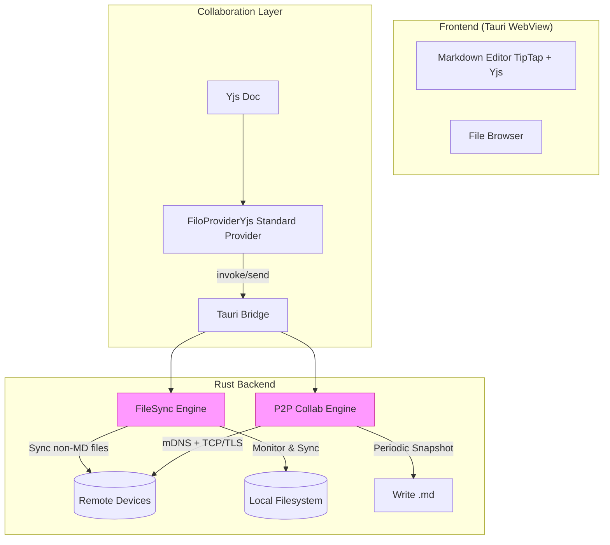
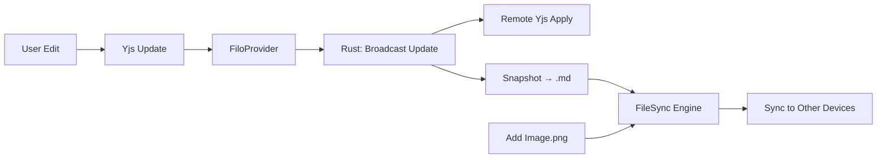

# **Filo 同步与协作引擎设计文档**  

**本地优先 · 去中心化 · 实时协同知识平台**  
*版本 1.0 — 2025 年 12 月*

---

## 一、概述

**Filo** 是一个面向个人与小团队的**局域网内去中心化知识协作系统**。它通过融合 **文件级同步** 与 **操作级实时协作**，实现以下核心体验：

- ✍️ 多人同时编辑 Markdown 文档，无冲突、低延迟  
- 📁 自动同步图片、附件等任意文件类型  
- 🔒 数据永不离开本地设备，无需云服务  
- 💾 离线可用，断网后恢复自动合并  

本设计文档聚焦 **同步引擎（FileSync Engine）** 与 **协作引擎（Collab Engine）** 的架构、职责划分与协同机制。

---

## 二、设计原则

| 原则 | 说明 |
|------|------|
| **Local-First** | 所有数据优先存储于本地，离线完整可用 |
| **Decentralized** | 无中心服务器，设备间直连（P2P） |
| **Separation of Concerns** | 文件同步 ≠ 实时协作，职责清晰分离 |
| **Yjs Native** | 遵循 Yjs 官方 Provider 模式，不重复造轮子 |
| **Privacy by Default** | 传输加密，可选端到端加密（Untrusted 模式） |

---

## 三、整体架构



> **关键边界**：  
>
> - **协作引擎**：处理 `.md` 的**实时编辑**  
> - **同步引擎**：处理**所有文件的持久化与分发**

---

## 四、协作引擎（Collab Engine）

### 4.1 目标

实现局域网内 **去中心化、无服务器的 Yjs 协作**，替代 Hocuspocus。

### 4.2 核心组件

| 组件 | 技术栈 | 职责 |
|------|--------|------|
| **FiloProvider** | TypeScript | Yjs 标准 Provider，桥接前端与 Rust |
| **P2P Network** | Rust (`mdns-sd`, `tokio`, `rustls`) | 设备发现、安全连接管理 |
| **Room Manager** | Rust | 以 `SHA256(文件路径)` 为 Room ID，隔离会话 |
| **Snapshot Service** | Rust + Tauri invoke | 定时从 Yjs 读取内容，写入 `.md` |

### 4.3 工作流程

1. **加入协作**  
   - 用户打开 `notes.md` → 前端创建 `Y.Doc()` + `new FiloProvider(room)`
   - `FiloProvider` 调用 `collab_join(room)`

2. **设备发现与连接**  
   - Rust 后端广播 `_filo-collab._tcp` mDNS 服务
   - 发现其他设备 → 建立双向 TLS 连接（证书 CN = Device ID）

3. **实时同步**  
   - 本地编辑 → Yjs 生成 `Update` → `collab_send_update(room, update)`
   - Rust 广播 `Update` 到所有 P2P 连接
   - 远程设备 apply `Update` → UI 实时更新

4. **持久化快照**  
   - 后台每 30 秒调用 `get_ydoc_content(room)` → 写入 `notes.md`

### 4.4 安全设计

- **传输层**：TLS 1.3（自签名证书）
- **认证**：Device ID 白名单（可选）
- **隐私**：Room ID 使用哈希，不暴露原始路径

---

## 五、文件同步引擎（FileSync Engine）

### 5.1 目标

可靠同步**非协作资源**（图片、PDF 等），并分发协作文档的**持久化快照**。

### 5.2 核心组件

| 组件 | 技术栈 | 职责 |
|------|--------|------|
| **File Watcher** | Rust (`notify`) | 监听目录变更（跳过 `.md`） |
| **Metadata DB** | SQLite | 存储 `path, hash, mtime, version_vector` |
| **Conflict Resolver** | Rust | 检测并发修改，生成 `.sync-conflict-<ts>` |
| **Transfer Protocol** | 自定义二进制协议 | 增量同步，支持断点续传 |

### 5.3 对 `.md` 文件的特殊处理

| 场景 | 行为 |
|------|------|
| **用户手动修改 `.md`** | ❌ 忽略（防止破坏 CRDT 状态） |
| **Collab Engine 写入 `.md`** | ✅ 触发同步（视为“权威快照”） |
| **新设备首次加入** | 1. 通过 Sync Engine 下载 `.md`<br>2. 用其内容初始化 Yjs Doc<br>3. 开始实时协作 |

### 5.4 元数据表结构

```sql
CREATE TABLE files (
    path TEXT PRIMARY KEY,          -- 相对路径
    size INTEGER NOT NULL,
    modified_sec INTEGER NOT NULL,  -- Unix timestamp
    hash BLOB NOT NULL,             -- SHA256
    version TEXT NOT NULL,          -- Version Vector as JSON
    is_deleted BOOLEAN NOT NULL DEFAULT 0,
    synced_at_sec INTEGER           -- 最后同步时间
);
```

---

## 六、两大引擎协同机制

### 6.1 协同场景：`project/plan.md` + `diagram.png`

| 步骤 | 协作引擎 | 同步引擎 |
|------|----------|----------|
| 1. A 创建文档 | 初始化 Yjs Doc | — |
| 2. B/C 加入 | P2P 接收初始状态 | — |
| 3. A 插入图片引用 | Yjs 更新文本 | — |
| 4. A 保存 `diagram.png` | — | 检测到新文件 → 同步到 B/C |
| 5. B 看到图片 | — | 从本地加载 `diagram.png` |
| 6. 后台快照 | 写入 `plan.md` | 检测变更 → 同步到离线设备 |
| 7. D 新设备加入 | 从 `plan.md` 初始化 Yjs | 下载 `plan.md` + `diagram.png` |

### 6.2 数据流图



---

## 七、为什么不用 `yrs`？

| 问题 | 解决方案 |
|------|----------|
| **状态冗余** | Yjs 已在前端完整运行，Rust 无需维护第二份状态 |
| **一致性风险** | 双端 Doc 难以保证完全同步 |
| **复杂度高** | 需实现前后端状态同步逻辑 |
| **不符合 Tauri 架构** | Tauri 是前端主导框架，CRDT 应在 WebView 中 |

> ✅ **正确模式**：  
> **Yjs（前端） + 自定义 Provider（前端） + P2P 透传（Rust）**

---

## 八、技术栈

| 层级 | 技术 |
|------|------|
| **前端** | React + TipTap + Yjs + `FiloProvider.ts` |
| **后端** | Rust + Tauri + `mdns-sd` + `tokio` + `rusqlite` |
| **网络** | mDNS + TCP/TLS + 自定义二进制协议 |
| **安全** | rustls (TLS) + AES-GCM (可选 E2EE) |
| **构建** | Cargo + Tauri CLI |

---

## 九、路线图

| 阶段 | 里程碑 |
|------|--------|
| **MVP（1个月）** | - 文件同步引擎（非MD）<br>- 单机 Markdown 编辑 |
| **Alpha（2个月）** | - FiloProvider + P2P 协作<br>- Awareness（光标共享） |
| **Beta（3个月）** | - 快照持久化<br>- TLS 安全连接 |
| **V1（4个月）** | - 端到端加密<br>- MCP 上下文服务 |

---

## 十、附录：关键决策记录（ADR）

| 决策 | 理由 |
|------|------|
| **使用 Yjs Provider 模式** | 符合官方生态，避免重复实现 CRDT |
| **分离协作与文件同步** | 职责清晰，避免耦合 |
| **Room ID = SHA256(路径)** | 跨设备一致，保护隐私 |
| **忽略用户对 .md 的修改** | 保证 CRDT 状态一致性 |
| **全互联拓扑（≤5 设备）** | 局域网延迟低，实现简单 |

---

> **Filo 不是另一个 Notion 或 Google Docs — 它是你私有的、去中心化的知识织网。**  
> — Filo Team, 2025
