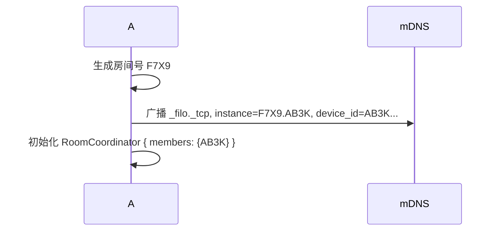
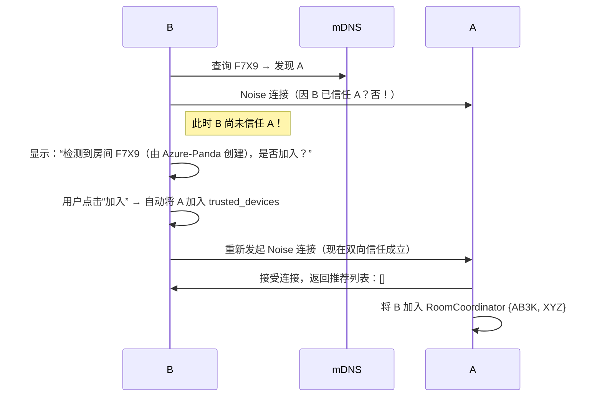
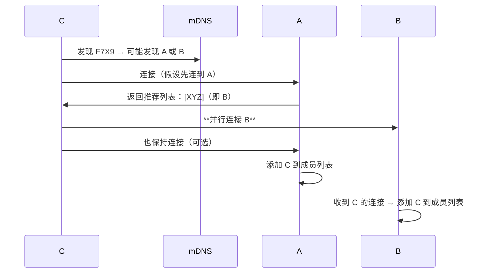

# **Filo：去中心化本地协作系统设计方案**  
**版本 1.0 — 安全 · 高效 · 无服务器**

---

## 📌 目标

构建一个 **无需互联网、无需中心服务器** 的本地多人实时协作系统，支持：
- ✅ **2~15 人** 在同一局域网内协同编辑文档/文件夹
- ✅ **端到端加密**，仅授权设备可访问
- ✅ **用户友好**：通过“房间号”一键加入
- ✅ **高可用**：任意设备可离线，协作不中断

---

## 🔐 一、身份体系：Device ID

### 1.1 Device ID 生成
- 每台设备首次启动时，生成 **Ed25519 密钥对**
- `Device ID = BLAKE3(public_key)[..24]`（Base32 编码，如 `AB3K-Q2RF-M9XP-L7TY`）
- 私钥安全存储于本地（Tauri 安全存储）

> ✅ **不可伪造、全局唯一、可验证签名**

### 1.2 身份展示
- 用户可见名：`Azure-Panda (AB3K...)`
- 完整 ID 用于技术交互，短 ID 用于 UI 显示

---

## 🔗 二、两两连接：Noise IK + mDNS

### 2.1 连接前提：**双向信任**
- A 要连接 B → A 必须已将 B 的 Device ID 加入 `trusted_devices`
- B 要接受 A → B 必须已将 A 的 Device ID 加入 `trusted_devices`

> ⚠️ **禁止“临时同意”建立信任**（防中间人攻击）

### 2.2 安全通道：Noise IK 协议
- 使用 [Noise Protocol Framework](https://noiseprotocol.org/) 的 `IK` 模式
- 静态密钥 = Ed25519 密钥对
- 前向保密 + 身份认证

```rust
// 连接流程
A → B: "Hello, I'm AB3K..., here's my static public key"
B → A: "I'm XYZ..., here's mine + encrypted payload"
// 双方验证对方公钥是否在信任列表
```

### 2.3 局域网发现：mDNS
- 服务类型：`_filo._tcp.local.`
- 实例名：`{room_code}.{short_id}`（如 `F7X9.AB3K`）
- TXT 记录：
  - `device_id=AB3K...`
  - `version=1`

---

## 🏠 三、多人协作：房间模型

### 3.1 房间 = 信任组 + 协作上下文
- **房间号**：4 字符 Base32 随机码（如 `F7X9`），有效期 **10 分钟**
- **房间本质**：一组互相信任的 Device ID 集合
- **房间不依赖创建者**：成员可自由进出

### 3.2 房间生命周期

#### 步骤 1：创建房间（A）


#### 步骤 2：B 加入房间


#### 步骤 3：C 加入房间（已有 A、B）


> ✅ **结果**：C 直接与 A、B 建立连接，形成三角 Mesh

---

## 🌐 四、网络拓扑：推荐机制 + 轻量 Gossip

### 4.1 连接策略
| 设备角色 | 连接行为 |
|----------|----------|
| **新成员** | 连接 ≥2 个推荐成员 |
| **现有成员** | 接受新连接，并更新本地成员列表 |

### 4.2 消息同步：轻量 Gossip
- 每台设备维护 **2~3 个邻居**
- 收到 Yjs Update 后：
  - 应用到本地 Doc
  - **转发给 2 个随机邻居**
  - TTL = 5（防环路）

### 4.3 拓扑自愈
- 每 30 秒：
  - 通过 mDNS 获取完整成员列表
  - 若发现未连接的成员，**以 10% 概率尝试连接**
- 防止网络分裂

---

## 🔒 五、安全模型

### 5.1 信任建立
- **唯一信任方式**：手动或扫码交换 Device ID
- **房间加入 = 自动互信**（因都通过同一房间上下文验证）

### 5.2 加密栈
| 层级 | 技术 | 作用 |
|------|------|------|
| 传输层 | Noise IK | 端到端加密 + 身份认证 |
| 应用层 | Yjs CRDT | 无冲突同步（无需额外加密） |
| 存储层 | Tauri Secure Storage | 保护私钥和信任列表 |

### 5.3 攻击防护
| 攻击 | 防御 |
|------|------|
| 中间人 | 双向 Device ID 验证 |
| 房间号爆破 | 10 分钟过期 + 4 字符（1M+ 组合） |
| 消息重放 | TTL + BloomFilter 去重 |
| 节点冒充 | Noise 静态密钥绑定 Device ID |

---

## 📱 六、用户体验流程

### 6.1 创建协作
```plaintext
[+] 开始协作
→ 生成房间号：F7X9
→ 二维码：[████████]
→ 有效期：10 分钟
```

### 6.2 加入协作
```plaintext
输入房间号：______   [扫码]

→ 发现房间 “F7X9”（由 Azure-Panda 创建）
→ 成员：2 人（包括创建者）

✅ 加入并信任同房间成员
```

### 6.3 协作中
- 实时显示成员头像/名称
- 可查看 Device ID（用于审计）
- 创建者退出后，房间继续存在

---

## 🧩 七、模块架构（Rust）

```
src/
├── identity/          # Device ID 生成与存储
├── auth/              # Noise IK 连接管理
├── gossip/            # 
│   ├── coordinator.rs # 房间成员管理
│   ├── discovery.rs   # mDNS 房间发现
│   └── broadcast.rs   # 轻量 Gossip 消息传播
├── yjs/               # Yjs 文档与更新处理
└── tauri/             # 前端命令绑定
```

### 核心数据结构
```rust
// 房间协调器（每台设备本地维护）
struct RoomCoordinator {
    room_code: String,
    members: RwLock<HashSet<DeviceId>>,
}

// 认证会话
struct AuthenticatedSession {
    peer_id: DeviceId,
    stream: NoiseStream,
}

// 全局状态
struct AppState {
    identity: Identity,
    rooms: RwLock<HashMap<String, Arc<RoomCoordinator>>>,
    sessions: RwLock<HashMap<DeviceId, AuthenticatedSession>>,
}
```

---

## 📈 八、性能与扩展性

| 规模 | 连接数/设备 | 带宽 | 延迟 | 适用性 |
|------|-------------|------|------|--------|
| 2–5 人 | 2–3 | 极低 | <50ms | ✅ 默认场景 |
| 6–15 人 | 3–4 | 低 | <100ms | ✅ 支持 |
| >15 人 | 需优化 | 中 | 可能升高 | ⚠️ 建议分房间 |

> 💡 **Filo 定位：小团队本地协作**，非大规模会议

---

## ✅ 九、总结：为什么这个设计安全且高效？

| 问题 | 解决方案 |
|------|----------|
| **如何信任陌生人？** | 房间上下文 + 自动互信（基于创建者背书） |
| **如何避免 Full Mesh？** | 推荐机制建立稀疏 Mesh + 轻量 Gossip |
| **创建者离线会断吗？** | 不会！成员已直连，房间自治 |
| **需要服务器吗？** | ❌ 纯局域网 P2P |
| **用户操作复杂吗？** | ✅ 只需分享/输入 4 位房间号 |

---

## 🚀 下一步

此方案可直接指导 Filo v1 开发。  
**核心优势**：在 **安全、去中心化、易用性** 三者间取得最佳平衡。

> 📄 **附：关键协议消息格式（供实现参考）**

```rust
// 加入请求
#[derive(Serialize)]
struct JoinRequest {
    requester_id: DeviceId,
    room_code: String,
}

// 加入响应
#[derive(Serialize)]
struct JoinResponse {
    recommended_peers: Vec<DeviceId>, // 其他成员
}

// Yjs 更新（Gossip）
#[derive(Serialize)]
struct SyncMessage {
    origin: DeviceId,
    yjs_update: Vec<u8>,
    ttl: u8,
}
```

---  
**Filo — Where trust is local, collaboration is seamless.**