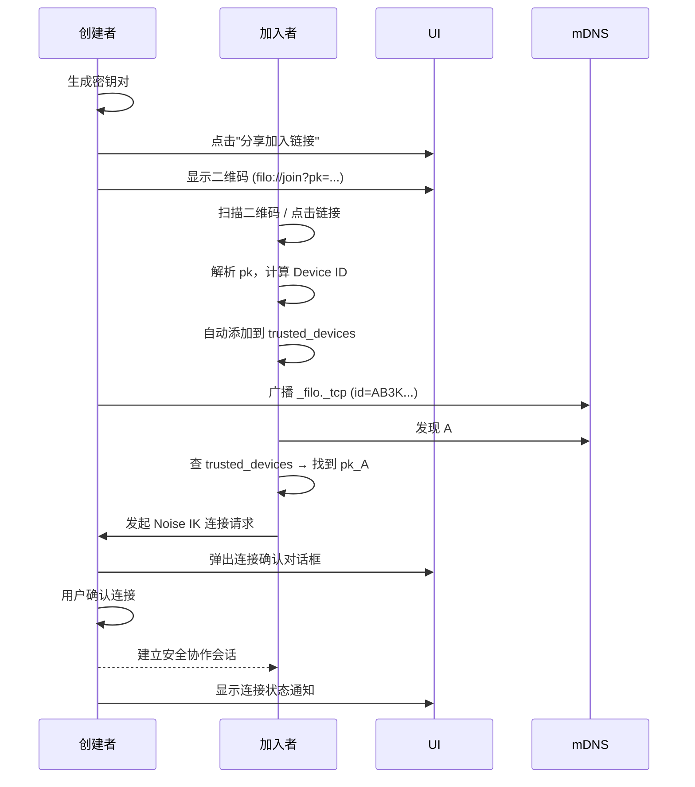

# Filo 去中心化本地协作系统

## 设备发现与安全连接设计文档

---

### 文档版本：1.0

### 最后更新：2025-12-12

### 作者：Filo Core Team

---

## 1. 目标

在无中心服务器的局域网环境中，实现以下能力：

- **设备自动发现**：用户可看到附近运行 Filo 的设备。
- **安全身份认证**：仅已信任设备可建立连接。
- **端到端加密通信**：使用 Noise 协议保障数据机密性与完整性。
- **零配置加入体验**：通过点击自定义链接（如 `filo://...`）一键添加并连接设备。

--- 

## 2. 核心原则

| 原则 | 说明 |
|------|------|
| **公钥即身份** | 每个设备拥有 Ed25519 密钥对，公钥是唯一身份标识 |
| **Device ID = BLAKE3[pubkey](..24)** | 24 字符十六进制字符串，用于 UI 显示和索引 |
| **信任必须显式建立** | 禁止临时同意或自动信任未知设备 |
| **mDNS 仅用于发现，不用于认证** | 不在 mDNS 中广播完整公钥 |
| **自定义协议驱动加入流程** | 通过 `filo://join?pk=...` 实现一键信任 |

---

## 3. 组件设计

### 3.1 密钥与身份

- 每个设备首次启动时生成 Ed25519 密钥对 `(sk, pk)`。
- Device ID 计算方式：

  ```rust
  let device_id = hex::encode(blake3::hash(&pubkey).as_bytes()[..12]); // 24 chars
  ```

### 3.2 公钥分发机制

#### 分享格式（URI Scheme）

```
filo://join?pk=<base64_pubkey>[&name=<url_encoded_name>]
```

- `pk`：Ed25519 公钥的 Base64 编码（32 字节 → 44 字符）
- `name`：可选，用于 UI 显示（非安全关键）

> ✅ **只传输公钥，Device ID 由接收方本地计算**

#### 接收方处理流程

1. 解析 `pk` 参数，Base64 解码为 `[u8; 32]`
2. 验证长度为 32 字节
3. 计算 `device_id = BLAKE3(pk)[..24]`
4. 存储到本地信任库：

   ```json
   {
     "ab3k4l7m9n2p5q8r": {
       "public_key": "d9jzqO2vXGkLmNpQrStUvWxYzAbCdEfGhIjKlMnOpQrS",
       "name": "Alice's MacBook",
       "added_at": "2025-12-12T22:30:00Z"
     }
   }
   ```

### 3.3 Tauri 自定义协议集成

#### 配置（`tauri.conf.json`）

```json
{
  "tauri": {
    "bundle": {
      "identifier": "com.filo.collab",
      "deepLink": {
        "scheme": "filo"
      }
    }
  }
}
```

#### 后端监听（Rust）

- 使用 `tauri-plugin-deep-link`
- 处理两种场景：
  - **冷启动**：从 `std::env::args().nth(1)` 获取 URL
  - **热启动**：监听 `tauri::RunEvent::DeepLink`

#### 前端响应（TypeScript）

```ts
listen('filo-invite-received', (event) => {
  invoke('add_trusted_device_from_url', { url: event.payload });
});
```

### 3.4 mDNS 服务发现

#### 广播内容（TXT 记录）

| 键 | 值 | 说明 |
|----|----|------|
| `id` | `ab3k4l...` | Device ID（公钥哈希） |
| `host` | `MyMacBook` | 主机名 |
| `os` | `macos` | 操作系统类型 |
| `ver` | `14.5` | OS 版本 |
| `arch` | `aarch64` | 架构 |

> ❌ **不包含完整公钥**

#### 服务注册（Rust）

```rust
let service_info = ServiceInfo::new(
    "_filo._tcp.local.",
    &format!("{}'s Filo", hostname()), // 友好名称
    "", // 使用默认主机名
    "",
    43210,
    txt_props,
)?.enable_addr_auto();
```

### 3.5 安全连接（Noise IK）

#### 握手前提

- Initiator（加入者）必须已在本地 `trusted_devices` 中存有 Responder 的完整公钥
- Responder 必须已在本地 `trusted_devices` 中存有 Initiator 的完整公钥

#### 连接流程

1. B 在 mDNS 列表中看到 A（`id=AB3K...`）
2. B 查询 `trusted_devices` → 获取 A 的完整公钥 `pk_A`
3. B 发起 Noise IK 握手：

   ```rust
   Builder::new("Noise_IK_25519_AESGCM_SHA256".parse()?)
       .local_private_key(&my_sk)
       .remote_public_key(&pk_A) // ← 关键
       .build_initiator()
   ```

4. A 收到连接后，从握手消息中提取 B 的公钥，验证其是否在 `trusted_devices` 中
5. 双向认证成功 → 建立加密通道

#### 连接确认与通知

当设备A向设备B发起连接时，需要进行用户确认和状态通知：

1. **连接确认**：
   - B端必须通过UI弹窗确认连接请求
   - 弹窗需显示A的设备信息（设备ID、主机名、平台、架构等）
   - 提供"拒绝"、"接受"、"接受并记住"三种操作选项
   - 即使A在B的信任列表中，也必须经过用户确认才能建立连接

2. **连接通知**：
   - 即使用户选择了"接受并记住"，实际连接建立时仍需提供通知状态
   - 通知应包含：连接设备的基本信息、连接状态、断开连接选项
   - 需在系统托盘/通知区域显示连接提示
   - 设备列表应实时更新连接状态并显示连接时长

3. **状态持久化**：
   - 用户确认结果可选择持久化，支持未来自动处理同一设备的连接请求
   - 应记录连接历史并允许用户随时取消"记住"设置

### 3.6 设备状态管理

#### 状态检测机制

为了实时跟踪设备在线状态，系统采用混合检测机制：

1. **mDNS 周期性发现**：
   - 每隔 30 秒重新扫描一次局域网中的 `_filo._tcp.local.` 服务
   - 当发现新设备时，将其标记为"在线"
   - 若某个设备在连续 3 次扫描中未出现，则标记为"离线"

2. **主动心跳检测**：
   - 对于已建立安全连接的设备，每 10 秒发送一次心跳包
   - 心跳超时时间设置为 30 秒
   - 若超过 30 秒未收到心跳响应，则标记设备为"可能离线"
   - 若超过 90 秒未收到心跳响应，则标记设备为"离线"

#### 状态变更通知

- 设备状态变更时，通过 Tauri 事件系统向前端发送通知：
  ```ts
  listen('device-status-changed', (event) => {
    const { device_id, status } = event.payload; // status: online | offline | connecting
    // 更新 UI 状态
  });
  ```

#### 状态存储

- 设备状态信息存储在本地数据库中：
  ```json
  {
    "ab3k4l7m9n2p5q8r": {
      "status": "online",
      "last_seen": "2025-12-12T22:30:00Z",
      "connection_type": "direct" // direct, relay, offline
    }
  }
  ```

---

## 4. 安全模型

| 威胁 | 防御措施 |
|------|----------|
| 中间人攻击（MITM） | 双向预信任 + Noise IK 密钥绑定 |
| 伪造设备 | mDNS ID 无法伪造（需私钥签名才能完成握手） |
| 未授权访问 | 未知设备无法发起有效连接 |
| 信息泄露 | mDNS 不暴露公钥，仅暴露哈希 ID |

> 🔒 **信任边界 = 本地 `trusted_devices` 数据库**

---

## 5. 用户体验流程



---

## 6. 附录

### 6.1 依赖项

- Rust crates:
  - `snow`（Noise 协议）
  - `mdns-sd`（mDNS 服务发现）
  - `tauri-plugin-deep-link`（自定义协议）
  - `blake3`, `base64`, `serde_json`

### 6.2 测试方法

- 手动触发 deep link：

  ```bash
  open "filo://join?pk=d9jzqO2vXGkLmNpQrStUvWxYzAbCdEfGhIjKlMnOpQrS"
  ```

- 使用 `dns-sd -B _filo._tcp`（macOS）或 `avahi-browse`（Linux）验证 mDNS 广播

---

> ✅ 本设计确保 Filo 在保持去中心化、无服务器架构的同时，提供企业级安全性和流畅的用户体验。