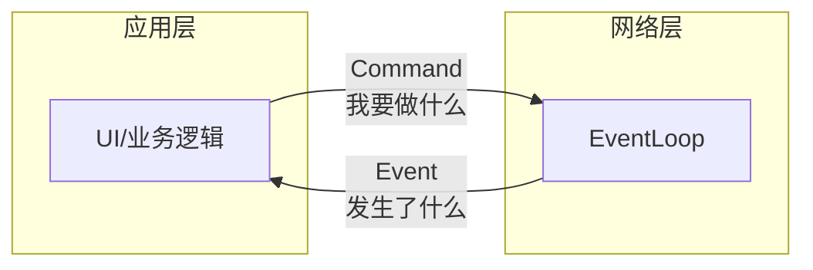
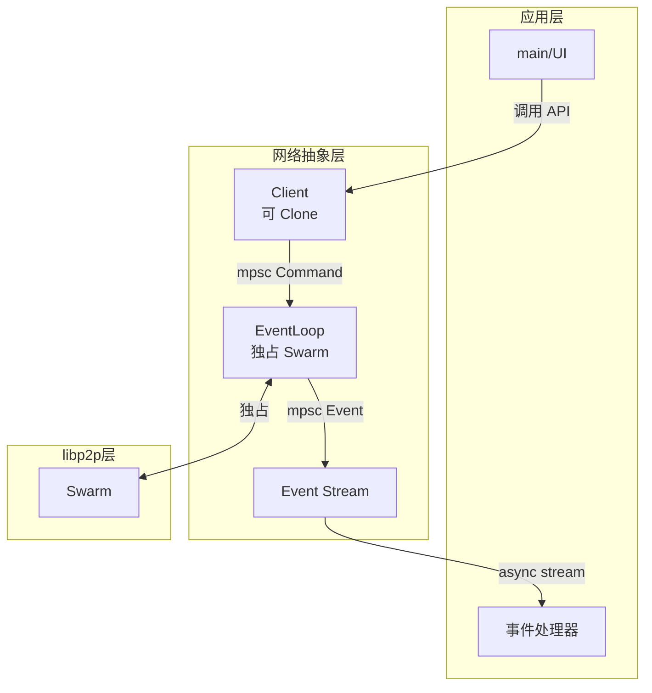
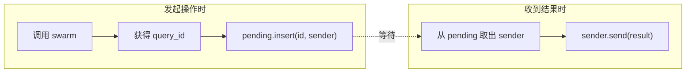
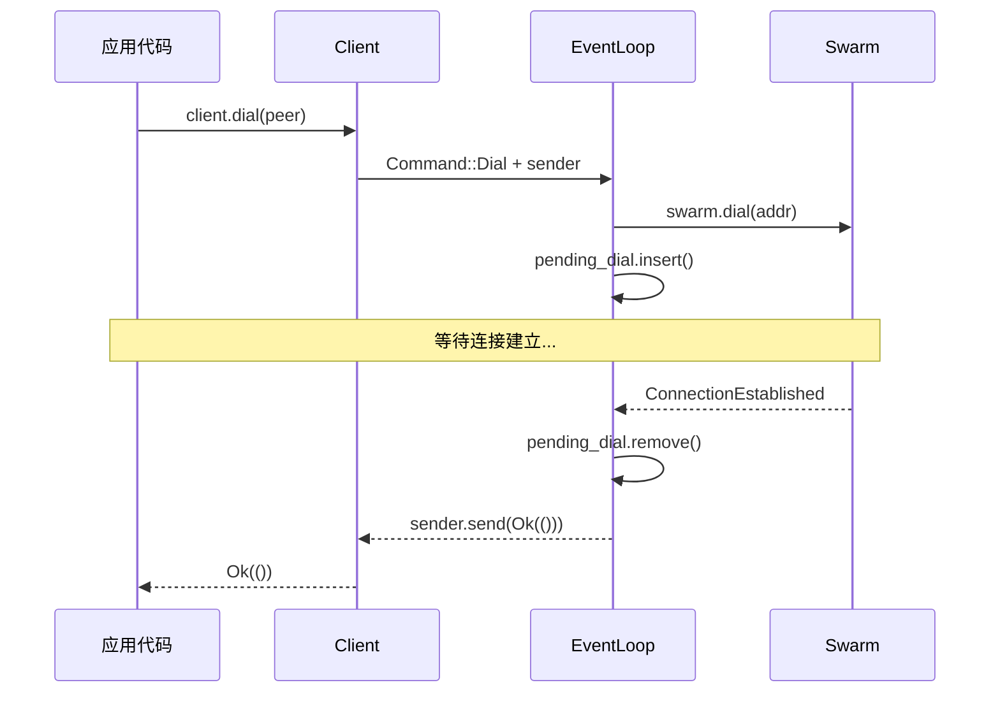

# Command-Event 分离模式详解

这是一种将**异步网络操作**与**业务逻辑**解耦的架构模式，在 P2P 应用中非常常见。

## 核心思想



- **Command**: 应用层告诉网络层"我要做什么"
- **Event**: 网络层告诉应用层"发生了什么"

## 为什么需要这种模式？

### 问题 1：libp2p 的 Swarm 不能直接共享

```rust
// ❌ 错误：Swarm 不是 Clone，不能在多处使用
let swarm = create_swarm();
let swarm_clone = swarm.clone();  // 编译错误！

tokio::spawn(async move { /* 用 swarm */ });
tokio::spawn(async move { /* 用 swarm_clone */ });
```

### 问题 2：Swarm 需要持续 poll

```rust
// ❌ 错误：如果不持续 poll，网络事件无法处理
async fn do_something(swarm: &mut Swarm) {
    swarm.dial(addr)?;
    // 这里没有 poll swarm，连接永远不会建立！
    tokio::time::sleep(Duration::from_secs(5)).await;
}
```

### 解决方案：单一所有者 + Channel 通信

```rust
// ✅ 正确：EventLoop 独占 Swarm，其他地方通过 Client 发命令
let (client, events, event_loop) = new().await?;

tokio::spawn(event_loop.run());  // 持续 poll swarm

client.dial(peer).await?;  // 通过 channel 发命令
```

## 三个核心组件



### 1. Client（命令发送者）

```rust
#[derive(Clone)]  // 可以克隆，到处使用
pub struct Client {
    sender: mpsc::Sender<Command>,
}

impl Client {
    pub async fn dial(&mut self, peer_id: PeerId, addr: Multiaddr) -> Result<()> {
        // 1. 创建一次性通道，用于接收结果
        let (sender, receiver) = oneshot::channel();

        // 2. 发送命令
        self.sender.send(Command::Dial { peer_id, addr, sender }).await?;

        // 3. 等待结果
        receiver.await?
    }
}
```

**特点**：
- 可 Clone，可在任意地方使用
- 方法是 `async fn`，调用者可以 `await` 等待结果
- 内部通过 channel 与 EventLoop 通信

### 2. EventLoop（命令执行者 + 事件分发者）

```rust
pub struct EventLoop {
    swarm: Swarm<Behaviour>,                    // 独占 swarm
    command_receiver: mpsc::Receiver<Command>,  // 接收命令
    event_sender: mpsc::Sender<Event>,          // 发送事件
    pending_dial: HashMap<PeerId, oneshot::Sender<Result<()>>>,  // 跟踪异步操作
}

impl EventLoop {
    pub async fn run(mut self) {
        loop {
            tokio::select! {
                // 处理网络事件
                event = self.swarm.select_next_some() => {
                    self.handle_event(event).await;
                }
                // 处理应用命令
                command = self.command_receiver.next() => {
                    match command {
                        Some(cmd) => self.handle_command(cmd).await,
                        None => return,  // channel 关闭，退出
                    }
                }
            }
        }
    }
}
```

**特点**：
- 独占 Swarm 所有权
- 持续运行，同时监听命令和网络事件
- 使用 `tokio::select!` 实现多路复用

### 3. Event（事件通知）

```rust
pub enum Event {
    InboundRequest { request: String, channel: ResponseChannel },
    PeerConnected { peer_id: PeerId },
    PeerDisconnected { peer_id: PeerId },
}
```

**特点**：
- 只包含应用层关心的事件
- 过滤掉底层细节（如心跳、路由更新等）

## Pending HashMap 模式

处理异步操作的关键技巧：



### 示例：处理 Dial

```rust
// 处理命令
async fn handle_command(&mut self, cmd: Command) {
    match cmd {
        Command::Dial { peer_id, addr, sender } => {
            match self.swarm.dial(addr) {
                Ok(()) => {
                    // 存储 sender，等连接建立后再发送结果
                    self.pending_dial.insert(peer_id, sender);
                }
                Err(e) => {
                    // 立即返回错误
                    let _ = sender.send(Err(e.into()));
                }
            }
        }
    }
}

// 处理事件
async fn handle_event(&mut self, event: SwarmEvent) {
    match event {
        SwarmEvent::ConnectionEstablished { peer_id, .. } => {
            // 连接建立，通知等待者
            if let Some(sender) = self.pending_dial.remove(&peer_id) {
                let _ = sender.send(Ok(()));
            }
        }
        SwarmEvent::OutgoingConnectionError { peer_id, error, .. } => {
            // 连接失败，通知等待者
            if let Some(peer_id) = peer_id {
                if let Some(sender) = self.pending_dial.remove(&peer_id) {
                    let _ = sender.send(Err(error.into()));
                }
            }
        }
    }
}
```

## 完整数据流



## 在 Filo 中的应用

```rust
// 定义命令
enum Command {
    StartListening { addr: Multiaddr, sender: oneshot::Sender<Result<()>> },
    BroadcastFileChange { path: PathBuf },
    RequestFileChunk { peer: PeerId, file_id: String, offset: u64, sender: oneshot::Sender<Result<Vec<u8>>> },
}

// 定义事件
enum Event {
    PeerDiscovered { peer_id: PeerId, device_name: String },
    PeerLost { peer_id: PeerId },
    FileChangeReceived { peer_id: PeerId, path: PathBuf, hash: String },
    FileChunkRequested { peer_id: PeerId, file_id: String, offset: u64, channel: ResponseChannel },
}

// 使用
async fn main() {
    let (client, events, event_loop) = network::new().await?;

    tokio::spawn(event_loop.run());

    // UI 线程可以直接用 client
    let client_for_ui = client.clone();

    // 处理事件
    tokio::spawn(async move {
        while let Some(event) = events.next().await {
            match event {
                Event::FileChangeReceived { path, .. } => {
                    // 同步文件...
                }
                // ...
            }
        }
    });
}
```

## 总结

| 组件 | 职责 | 特点 |
|------|------|------|
| Client | 提供 API | 可 Clone，async 方法 |
| EventLoop | 驱动网络 | 独占 Swarm，持续运行 |
| Command | 应用→网络 | 带 oneshot sender |
| Event | 网络→应用 | 只含业务相关事件 |
| pending_* | 跟踪异步操作 | HashMap<ID, Sender> |

这种模式的核心价值：**让网络操作像普通异步函数一样简单调用**。
