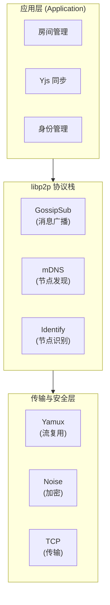
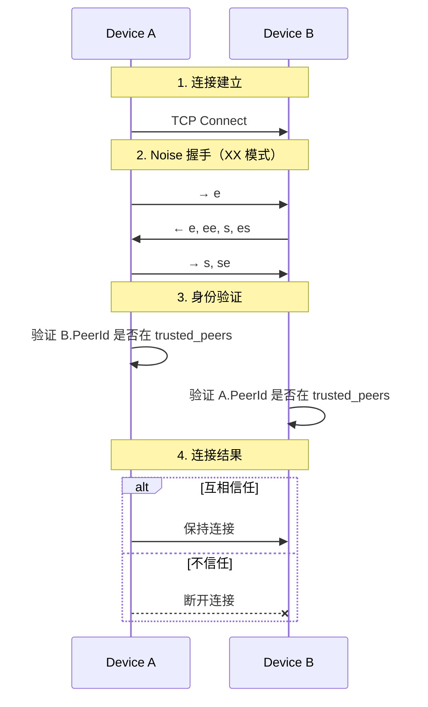
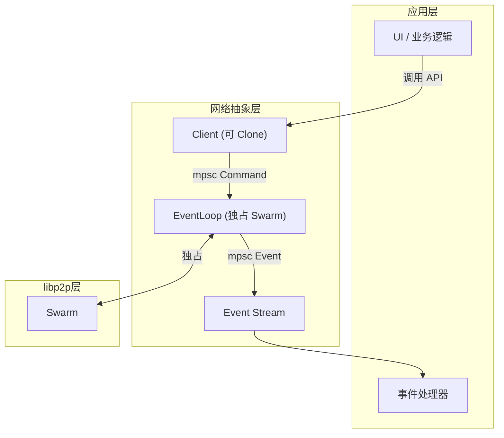
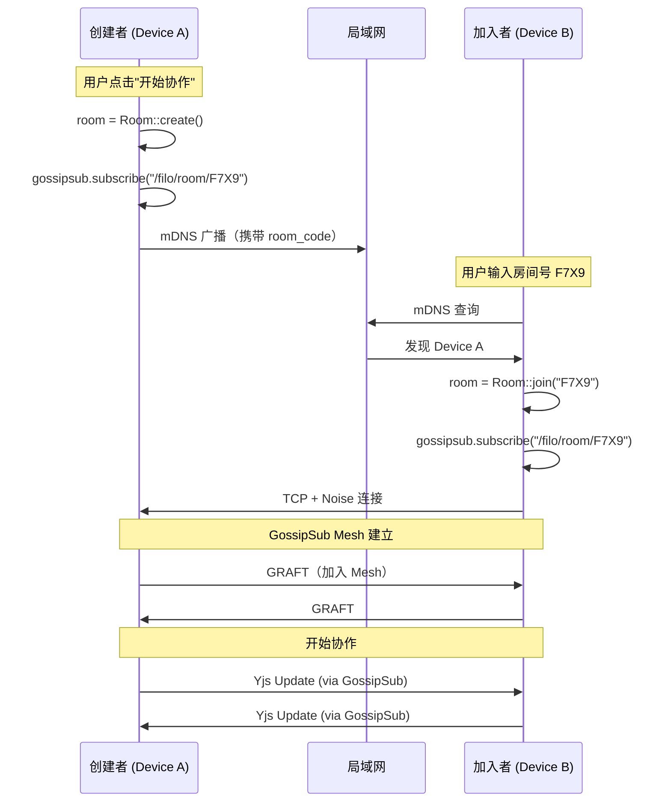
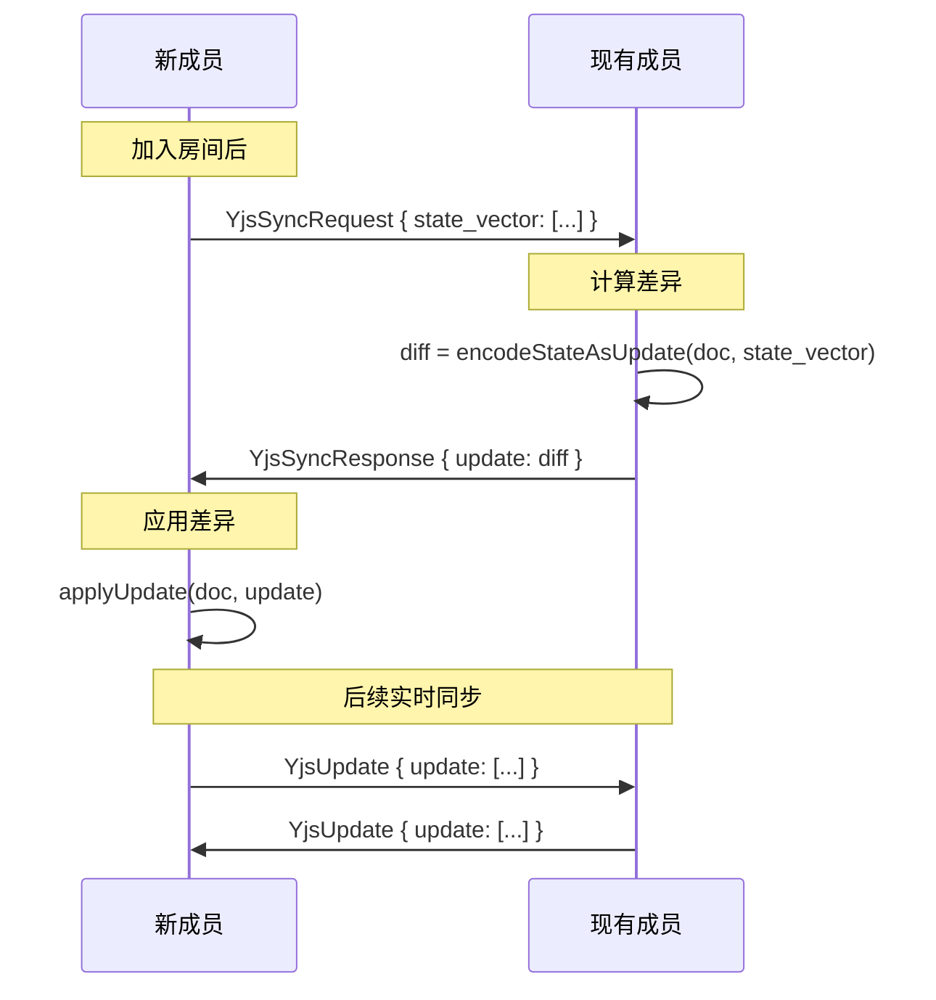
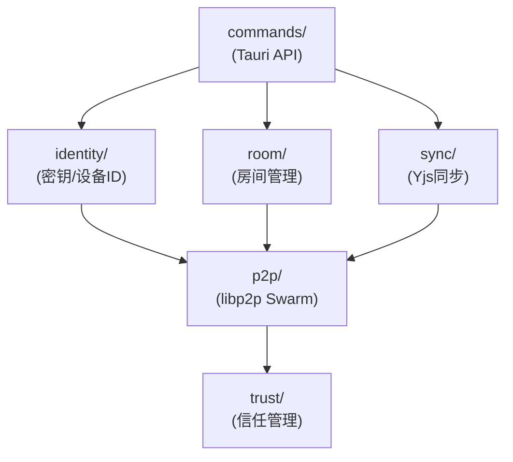

# Filo P2P 协作系统设计文档

**基于 libp2p 的去中心化本地协作系统**
*版本 2.0 — 2025 年 12 月*

---

## 目录

1. [概述](#一概述)
2. [身份体系](#二身份体系)
3. [网络架构](#三网络架构)
4. [房间模型](#四房间模型)
5. [消息协议](#五消息协议)
6. [点对点直连](#六点对点直连)
7. [安全模型](#七安全模型)
8. [Tauri 集成](#八tauri-集成)
9. [SwarmEvent 事件处理](#九swarmevent-事件处理)
10. [模块架构](#十模块架构)
11. [附录](#十一附录)

---

## 一、概述

### 1.1 项目背景

Filo 是一个面向个人与小团队的**局域网内去中心化知识协作系统**。本文档描述基于 **rust-libp2p** 的 P2P 网络层设计。

### 1.2 设计目标

| 目标 | 说明 |
|------|------|
| **无服务器** | 无需互联网、无需中心服务器，纯局域网运行 |
| **实时协作** | 2~15 人同时编辑文档，延迟 <100ms |
| **端到端加密** | 所有通信经过 Noise 协议加密 |
| **用户友好** | 通过"房间号"一键加入，无需配置 IP/端口 |
| **高可用** | 任意设备可离线，协作不中断 |

### 1.3 核心技术栈



---

## 二、身份体系

### 2.1 密钥与标识

每台设备首次启动时，生成并持久化一个 **Ed25519 密钥对**：

```rust
// 密钥生成
let keypair = identity::Keypair::generate_ed25519();

// 导出为字节（用于持久化）
let keypair_bytes = keypair.try_into_ed25519()?.to_bytes();
```

**标识体系：**

| 标识 | 生成方式 | 用途 |
|------|----------|------|
| **PeerId** | `SHA256(public_key)` 的 Multihash | libp2p 网络层标识 |
| **Device ID** | `Base32(public_key)[..16]` | 用户可见的简短标识 |
| **Display Name** | 随机词组 + Device ID 前缀 | 用户友好的名称 |

**示例：**
```
PeerId:       12D3KooWEyoppNCUVQFna...（52字符）
Device ID:    AB3KQ2RFM9XPL7TY
Display Name: Azure-Panda (AB3K...)
```

### 2.2 密钥持久化

使用 Tauri 的安全存储机制持久化密钥：

```rust
// 存储位置（平台相关）
// Windows: %APPDATA%\com.filo.app\
// macOS:   ~/Library/Application Support/com.filo.app/
// Linux:   ~/.local/share/com.filo.app/

pub struct IdentityStore {
    keypair: Keypair,
    device_id: String,
    display_name: String,
}

impl IdentityStore {
    /// 加载或创建身份
    pub async fn load_or_create() -> Result<Self> {
        if let Some(bytes) = secure_storage::get("keypair")? {
            let keypair = Keypair::ed25519_from_bytes(bytes)?;
            Ok(Self::from_keypair(keypair))
        } else {
            let identity = Self::generate();
            secure_storage::set("keypair", identity.keypair.to_bytes())?;
            Ok(identity)
        }
    }
}
```

### 2.3 身份验证流程



---

## 三、网络架构

### 3.1 Command-Event 分离架构

采用 Command-Event 分离模式，将网络操作与业务逻辑解耦：



**核心组件：**

| 组件 | 职责 | 特点 |
|------|------|------|
| `Client` | 提供异步 API | 可 Clone，任意位置调用 |
| `EventLoop` | 驱动网络 | 独占 Swarm，持续运行 |
| `Command` | 应用→网络 | 带 oneshot sender 返回结果 |
| `Event` | 网络→应用 | 只含业务相关事件 |

**Command 定义：**

```rust
pub enum Command {
    StartListening { addr: Multiaddr, sender: oneshot::Sender<Result<()>> },
    JoinRoom { code: String, sender: oneshot::Sender<Result<()>> },
    LeaveRoom { code: String },
    BroadcastYjs { room_code: String, update: Vec<u8> },
    RequestFileChunk { peer: PeerId, hash: [u8; 32], sender: oneshot::Sender<Result<Vec<u8>>> },
}
```

**Event 定义：**

```rust
pub enum Event {
    PeerDiscovered { peer_id: PeerId, device_name: String },
    PeerLost { peer_id: PeerId },
    RoomMemberJoined { room_code: String, peer_id: PeerId },
    RoomMemberLeft { room_code: String, peer_id: PeerId },
    YjsUpdateReceived { room_code: String, update: Vec<u8> },
    FileChunkRequested { peer_id: PeerId, hash: [u8; 32], channel: ResponseChannel },
}
```

### 3.2 libp2p 组件选型

| 功能 | 组件 | 配置 | 说明 |
|------|------|------|------|
| **传输层** | TCP | `tcp::Config::default()` | 局域网可靠连接 |
| **安全层** | Noise | `noise::Config::new` | XX 模式，端到端加密 |
| **流复用** | Yamux | `yamux::Config::default()` | 单 TCP 连接承载多协议流 |
| **节点发现** | mDNS | `mdns::Config::default()` | 自动发现同局域网节点 |
| **消息广播** | GossipSub | 自定义配置 | 可靠、高效的 Pub/Sub |
| **节点识别** | Identify | `identify::Config` | 交换节点元信息 |
| **文件传输** | request-response | CBOR 编解码 | 点对点请求/响应 |

### 3.3 Swarm 构建

```rust
use libp2p::{
    identity, mdns, gossipsub, identify, noise, tcp, yamux,
    request_response, swarm::NetworkBehaviour, Swarm, SwarmBuilder,
};

/// Filo 网络行为组合
#[derive(NetworkBehaviour)]
pub struct FiloBehaviour {
    /// mDNS 本地网络发现
    pub mdns: mdns::tokio::Behaviour,
    /// GossipSub 消息传播
    pub gossipsub: gossipsub::Behaviour,
    /// Identify 节点识别
    pub identify: identify::Behaviour,
    /// 文件块传输
    pub file_transfer: request_response::cbor::Behaviour<ChunkRequest, ChunkResponse>,
}

/// 创建 Swarm 实例
pub async fn create_swarm(keypair: identity::Keypair) -> Result<Swarm<FiloBehaviour>> {
    let peer_id = keypair.public().to_peer_id();

    // GossipSub 配置
    let gossipsub_config = gossipsub::ConfigBuilder::default()
        .heartbeat_interval(Duration::from_secs(10))
        .validation_mode(gossipsub::ValidationMode::Strict)
        .message_id_fn(|msg| {
            let mut hasher = DefaultHasher::new();
            msg.data.hash(&mut hasher);
            gossipsub::MessageId::from(hasher.finish().to_string())
        })
        .build()
        .map_err(|e| anyhow::anyhow!("GossipSub config error: {}", e))?;

    let gossipsub = gossipsub::Behaviour::new(
        gossipsub::MessageAuthenticity::Signed(keypair.clone()),
        gossipsub_config,
    )?;

    // Identify 配置
    let identify = identify::Behaviour::new(
        identify::Config::new("/filo/1.0.0".to_string(), keypair.public())
            .with_agent_version(format!("filo/{}", env!("CARGO_PKG_VERSION"))),
    );

    // mDNS 配置
    let mdns = mdns::tokio::Behaviour::new(mdns::Config::default(), peer_id)?;

    let behaviour = FiloBehaviour { mdns, gossipsub, identify };

    // 构建 Swarm
    let swarm = SwarmBuilder::with_existing_identity(keypair)
        .with_tokio()
        .with_tcp(
            tcp::Config::default(),
            noise::Config::new,
            yamux::Config::default,
        )?
        .with_behaviour(|_| behaviour)?
        .with_swarm_config(|cfg| {
            cfg.with_idle_connection_timeout(Duration::from_secs(60))
        })
        .build();

    Ok(swarm)
}
```

---

## 四、房间模型

### 4.1 概念设计

房间是协作的基本单位，映射到 GossipSub 的 Topic：

| 概念 | 实现 |
|------|------|
| **房间号** | 4 字符 Base32 随机码（如 `F7X9`） |
| **Topic** | `/filo/room/{room_code}`（如 `/filo/room/F7X9`） |
| **房间密钥** | 可选，用于端到端加密消息内容 |

**特性：**
- 房间无创建者依赖，所有成员平等
- 任意节点可退出，房间继续存在
- 房间号有效期可配置（默认 10 分钟）

### 4.2 房间数据结构

```rust
use libp2p::{gossipsub::IdentTopic, PeerId};
use std::collections::{HashMap, HashSet};

/// 房间状态
pub struct Room {
    /// 房间号（4字符）
    pub code: String,
    /// GossipSub Topic
    pub topic: IdentTopic,
    /// 房间成员
    pub members: HashSet<PeerId>,
    /// 创建时间
    pub created_at: Instant,
    /// 可选：房间密钥（用于 E2EE）
    pub secret_key: Option<[u8; 32]>,
}

impl Room {
    /// 创建新房间
    pub fn create() -> Self {
        let code = generate_room_code();
        let topic = IdentTopic::new(format!("/filo/room/{}", code));
        Self {
            code,
            topic,
            members: HashSet::new(),
            created_at: Instant::now(),
            secret_key: None,
        }
    }

    /// 加入已有房间
    pub fn join(code: &str) -> Self {
        let topic = IdentTopic::new(format!("/filo/room/{}", code));
        Self {
            code: code.to_string(),
            topic,
            members: HashSet::new(),
            created_at: Instant::now(),
            secret_key: None,
        }
    }
}

/// 房间管理器
pub struct RoomManager {
    rooms: HashMap<String, Room>,
    local_peer_id: PeerId,
}

impl RoomManager {
    pub fn create_room(&mut self, swarm: &mut Swarm<FiloBehaviour>) -> Result<String> {
        let room = Room::create();
        let code = room.code.clone();
        swarm.behaviour_mut().gossipsub.subscribe(&room.topic)?;
        self.rooms.insert(code.clone(), room);
        Ok(code)
    }

    pub fn join_room(&mut self, code: &str, swarm: &mut Swarm<FiloBehaviour>) -> Result<()> {
        let room = Room::join(code);
        swarm.behaviour_mut().gossipsub.subscribe(&room.topic)?;
        self.rooms.insert(code.to_string(), room);
        Ok(())
    }

    pub fn leave_room(&mut self, code: &str, swarm: &mut Swarm<FiloBehaviour>) -> Result<()> {
        if let Some(room) = self.rooms.remove(code) {
            swarm.behaviour_mut().gossipsub.unsubscribe(&room.topic)?;
        }
        Ok(())
    }
}

/// 生成 4 字符 Base32 房间号
fn generate_room_code() -> String {
    use rand::Rng;
    const CHARSET: &[u8] = b"0123456789ABCDEFGHJKMNPQRSTVWXYZ";
    let mut rng = rand::thread_rng();
    (0..4).map(|_| CHARSET[rng.gen_range(0..32)] as char).collect()
}
```

### 4.3 房间加入流程



---

## 五、消息协议

### 5.1 消息类型

```rust
use serde::{Deserialize, Serialize};

/// Filo 消息类型
#[derive(Debug, Clone, Serialize, Deserialize)]
pub enum FiloMessage {
    /// Yjs 文档更新
    YjsUpdate {
        doc_id: String,
        update: Vec<u8>,
    },
    /// Yjs 状态向量请求
    YjsSyncRequest {
        doc_id: String,
        state_vector: Vec<u8>,
    },
    /// Yjs 状态向量响应
    YjsSyncResponse {
        doc_id: String,
        update: Vec<u8>,
    },
    /// Awareness 更新（光标、选区等）
    AwarenessUpdate {
        doc_id: String,
        state: Vec<u8>,
    },
    /// 房间元信息
    RoomMeta {
        members: Vec<MemberInfo>,
    },
    /// 心跳/存在确认
    Heartbeat {
        timestamp: u64,
    },
}

/// 成员信息
#[derive(Debug, Clone, Serialize, Deserialize)]
pub struct MemberInfo {
    pub peer_id: String,
    pub device_id: String,
    pub display_name: String,
    pub cursor_color: String,
}
```

### 5.2 消息编解码

```rust
use bincode::{deserialize, serialize};

impl FiloMessage {
    pub fn encode(&self) -> Result<Vec<u8>> {
        Ok(serialize(self)?)
    }

    pub fn decode(data: &[u8]) -> Result<Self> {
        Ok(deserialize(data)?)
    }
}

/// 发送消息到房间
pub fn broadcast_to_room(
    swarm: &mut Swarm<FiloBehaviour>,
    room_code: &str,
    message: FiloMessage,
) -> Result<()> {
    let topic = IdentTopic::new(format!("/filo/room/{}", room_code));
    let data = message.encode()?;
    swarm.behaviour_mut().gossipsub.publish(topic, data)?;
    Ok(())
}
```

### 5.3 Yjs 同步协议

新成员加入时的同步流程：



---

## 六、点对点直连

### 6.1 使用场景

| 场景 | 说明 |
|------|------|
| **1对1 文件传输** | 直接分享 PeerId，无需创建房间 |
| **添加好友** | 交换 PeerId 后永久互信 |
| **跨网段连接** | 配合中继服务器，突破局域网限制 |

### 6.2 与房间模式对比

| 特性 | 房间模式 | PeerId 直连 |
|------|----------|-------------|
| 发现方式 | mDNS 自动发现 | 手动输入/扫码 |
| 连接数 | 多人 (2-15) | 1对1 |
| 有效期 | 临时 (房间号过期) | 永久 (PeerId 不变) |
| 信任建立 | 加入房间时自动信任 | 输入 PeerId 时建立信任 |

### 6.3 连接信息格式

```
filo://<PeerId>?pk=<Base64PublicKey>&addr=<Multiaddr>

示例:
filo://12D3KooWEyoppNCUVQFna8iopt3hSr4DwKBReg1ML4R1vPLCdGZi?addr=/ip4/192.168.1.100/tcp/45678
```

### 6.4 数据结构

```rust
use libp2p::{Multiaddr, PeerId, identity::PublicKey};

/// 对等节点连接信息
#[derive(Debug, Clone, Serialize, Deserialize)]
pub struct PeerConnectInfo {
    pub peer_id: PeerId,
    pub public_key: PublicKey,
    pub addresses: Vec<Multiaddr>,
    pub display_name: Option<String>,
}

impl PeerConnectInfo {
    pub fn from_local(keypair: &Keypair, addresses: Vec<Multiaddr>) -> Self {
        Self {
            peer_id: keypair.public().to_peer_id(),
            public_key: keypair.public(),
            addresses,
            display_name: None,
        }
    }

    pub fn to_url(&self) -> String {
        let mut url = format!("filo://{}", self.peer_id.to_base58());
        if !self.addresses.is_empty() {
            let addrs: Vec<String> = self.addresses.iter()
                .map(|a| urlencoding::encode(&a.to_string()).to_string())
                .collect();
            url.push_str(&format!("?addr={}", addrs.join(",")));
        }
        url
    }

    pub fn from_url(url: &str) -> Result<Self> {
        let url = url.strip_prefix("filo://").ok_or(anyhow!("Invalid scheme"))?;
        let (peer_id_str, query) = url.split_once('?').unwrap_or((url, ""));
        let peer_id: PeerId = peer_id_str.parse()?;
        let public_key = extract_ed25519_pubkey(&peer_id)?;

        let mut addresses = Vec::new();
        for param in query.split('&') {
            if let Some(addrs) = param.strip_prefix("addr=") {
                for addr in addrs.split(',') {
                    let decoded = urlencoding::decode(addr)?;
                    addresses.push(decoded.parse()?);
                }
            }
        }

        Ok(Self { peer_id, public_key, addresses, display_name: None })
    }
}
```

### 6.5 已知节点管理

```rust
/// 已知节点注册表
pub struct KnownPeers {
    peers: HashMap<PeerId, PublicKey>,
    storage_path: PathBuf,
}

impl KnownPeers {
    pub fn register(&mut self, info: &PeerConnectInfo) {
        self.peers.insert(info.peer_id, info.public_key.clone());
        self.persist();
    }

    pub fn verify(&self, peer_id: &PeerId, actual_key: &PublicKey) -> VerifyResult {
        match self.peers.get(peer_id) {
            Some(expected) if expected == actual_key => VerifyResult::Trusted,
            Some(_) => VerifyResult::KeyMismatch,
            None => VerifyResult::Unknown,
        }
    }
}

#[derive(Debug, PartialEq)]
pub enum VerifyResult {
    Trusted,
    KeyMismatch,
    Unknown,
}
```

---

## 七、安全模型

### 7.1 信任管理

```rust
/// 信任管理器
pub struct TrustManager {
    trusted_peers: HashSet<PeerId>,
    storage_path: PathBuf,
}

impl TrustManager {
    pub fn trust(&mut self, peer_id: PeerId) {
        self.trusted_peers.insert(peer_id);
        self.persist();
    }

    pub fn untrust(&mut self, peer_id: &PeerId) {
        self.trusted_peers.remove(peer_id);
        self.persist();
    }

    pub fn is_trusted(&self, peer_id: &PeerId) -> bool {
        self.trusted_peers.contains(peer_id)
    }
}
```

### 7.2 加密层级

| 层级 | 技术 | 作用 |
|------|------|------|
| **传输层** | Noise Protocol (XX) | 端到端加密所有网络流量 |
| **消息层** | GossipSub Signing | 消息签名，防止伪造 |
| **内容层** | AES-256-GCM（可选） | 房间密钥加密，额外隐私保护 |
| **存储层** | Tauri Secure Storage | 保护本地密钥和信任列表 |

### 7.3 威胁防护

| 威胁 | 防护措施 |
|------|----------|
| **中间人攻击** | 应用层公钥验证，不匹配立即断开 |
| **PeerId 伪造** | PeerId 由公钥派生，无法伪造 |
| **重放攻击** | Noise 协议内置 nonce |
| **窃听** | Noise 加密所有流量 |

### 7.4 可选房间端到端加密

```rust
use aes_gcm::{Aes256Gcm, KeyInit, Nonce};
use aes_gcm::aead::Aead;

impl Room {
    pub fn enable_e2ee(&mut self) {
        let key: [u8; 32] = rand::random();
        self.secret_key = Some(key);
    }

    pub fn encrypt(&self, plaintext: &[u8]) -> Result<Vec<u8>> {
        let key = self.secret_key.ok_or_else(|| anyhow!("E2EE not enabled"))?;
        let cipher = Aes256Gcm::new_from_slice(&key)?;
        let nonce_bytes: [u8; 12] = rand::random();
        let nonce = Nonce::from_slice(&nonce_bytes);
        let ciphertext = cipher.encrypt(nonce, plaintext)?;
        let mut result = nonce_bytes.to_vec();
        result.extend(ciphertext);
        Ok(result)
    }

    pub fn decrypt(&self, data: &[u8]) -> Result<Vec<u8>> {
        let key = self.secret_key.ok_or_else(|| anyhow!("E2EE not enabled"))?;
        let cipher = Aes256Gcm::new_from_slice(&key)?;
        let (nonce_bytes, ciphertext) = data.split_at(12);
        let nonce = Nonce::from_slice(nonce_bytes);
        Ok(cipher.decrypt(nonce, ciphertext)?)
    }
}
```

---

## 八、Tauri 集成

### 8.1 应用状态（基于 Command-Event 架构）

```rust
use futures::channel::mpsc;
use tauri::State;

pub struct AppState {
    /// 网络客户端（可 Clone，线程安全）
    pub client: Client,
    /// 身份信息
    pub identity: IdentityStore,
}

/// 网络客户端
#[derive(Clone)]
pub struct Client {
    sender: mpsc::Sender<Command>,
}

impl Client {
    pub async fn join_room(&mut self, code: &str) -> Result<()> {
        let (sender, receiver) = oneshot::channel();
        self.sender.send(Command::JoinRoom {
            code: code.to_string(),
            sender,
        }).await?;
        receiver.await?
    }

    pub async fn broadcast_yjs(&mut self, room_code: &str, update: Vec<u8>) -> Result<()> {
        self.sender.send(Command::BroadcastYjs {
            room_code: room_code.to_string(),
            update,
        }).await?;
        Ok(())
    }
}
```

### 8.2 Tauri 命令

```rust
#[tauri::command]
pub async fn p2p_start(
    app: tauri::AppHandle,
    state: State<'_, AppState>,
) -> Result<String, String> {
    let keypair = state.identity.keypair.clone();
    let (client, events, event_loop) = network::new(keypair).await.map_err(|e| e.to_string())?;

    // 启动网络事件循环
    tokio::spawn(event_loop.run());

    // 转发事件到前端
    let app_handle = app.clone();
    tokio::spawn(async move {
        while let Some(event) = events.next().await {
            match event {
                Event::YjsUpdateReceived { room_code, update } => {
                    app_handle.emit("yjs:update", serde_json::json!({
                        "room_code": room_code,
                        "update": update,
                    })).ok();
                }
                Event::PeerDiscovered { peer_id, device_name } => {
                    app_handle.emit("peer:discovered", serde_json::json!({
                        "peer_id": peer_id.to_string(),
                        "device_name": device_name,
                    })).ok();
                }
                // ... 其他事件
            }
        }
    });

    Ok(state.identity.device_id.clone())
}

#[tauri::command]
pub async fn room_join(code: String, state: State<'_, AppState>) -> Result<(), String> {
    state.client.clone().join_room(&code).await.map_err(|e| e.to_string())
}

#[tauri::command]
pub async fn yjs_broadcast(
    room_code: String,
    update: Vec<u8>,
    state: State<'_, AppState>,
) -> Result<(), String> {
    state.client.clone().broadcast_yjs(&room_code, update).await.map_err(|e| e.to_string())
}
```

### 8.3 前端事件监听

```typescript
// src/commands/p2p.ts
import { invoke } from '@tauri-apps/api/core';
import { listen } from '@tauri-apps/api/event';

export async function startP2P(): Promise<string> {
  return await invoke('p2p_start');
}

export async function createRoom(): Promise<string> {
  return await invoke('room_create');
}

export async function joinRoom(code: string): Promise<void> {
  return await invoke('room_join', { code });
}

export async function broadcastYjsUpdate(roomCode: string, update: Uint8Array): Promise<void> {
  return await invoke('yjs_broadcast', {
    roomCode,
    update: Array.from(update)
  });
}

export function onYjsUpdate(callback: (docId: string, update: Uint8Array) => void): () => void {
  const unlisten = listen<{ doc_id: string; update: number[] }>('yjs:update', (event) => {
    callback(event.payload.doc_id, new Uint8Array(event.payload.update));
  });
  return () => { unlisten.then(fn => fn()); };
}
```

### 8.4 Yjs Provider 集成

```typescript
// src/providers/FiloProvider.ts
import * as Y from 'yjs';
import { Awareness } from 'y-protocols/awareness';
import { broadcastYjsUpdate, onYjsUpdate } from '../commands/p2p';

export class FiloProvider {
  doc: Y.Doc;
  awareness: Awareness;
  roomCode: string;
  private unlistenYjs?: () => void;

  constructor(doc: Y.Doc, roomCode: string) {
    this.doc = doc;
    this.roomCode = roomCode;
    this.awareness = new Awareness(doc);

    this.doc.on('update', (update: Uint8Array, origin: unknown) => {
      if (origin !== 'remote') {
        broadcastYjsUpdate(this.roomCode, update);
      }
    });

    this.unlistenYjs = onYjsUpdate((docId, update) => {
      if (docId === this.roomCode) {
        Y.applyUpdate(this.doc, update, 'remote');
      }
    });
  }

  destroy() {
    this.unlistenYjs?.();
    this.awareness.destroy();
  }
}
```

---

## 九、SwarmEvent 事件处理

### 9.1 事件分类

| 类别       | 事件                        | 触发时机     |
| -------- | ------------------------- | -------- |
| **行为事件** | `Behaviour`               | 子协议产生事件  |
| **连接事件** | `ConnectionEstablished`   | 新连接建立成功  |
|          | `ConnectionClosed`        | 连接关闭     |
|          | `IncomingConnection`      | 收到入站连接请求 |
|          | `OutgoingConnectionError` | 出站连接失败   |
| **监听事件** | `NewListenAddr`           | 开始监听新地址  |
|          | `ListenerError`           | 监听器错误    |
| **拨号事件** | `Dialing`                 | 开始拨号连接   |

### 9.2 mDNS 事件

```rust
match event {
    mdns::Event::Discovered(peers) => {
        for (peer_id, addr) in peers {
            info!("发现节点: {} at {}", peer_id, addr);
            swarm.dial(addr)?;
            swarm.behaviour_mut().gossipsub.add_explicit_peer(&peer_id);
        }
    }
    mdns::Event::Expired(peers) => {
        for (peer_id, _) in peers {
            info!("节点离线: {}", peer_id);
            swarm.behaviour_mut().gossipsub.remove_explicit_peer(&peer_id);
        }
    }
}
```

### 9.3 GossipSub 事件

```rust
match event {
    gossipsub::Event::Message { message, propagation_source, .. } => {
        let filo_msg: FiloMessage = bincode::deserialize(&message.data)?;
        handle_filo_message(filo_msg).await?;
    }
    gossipsub::Event::Subscribed { peer_id, topic } => {
        info!("{} 订阅了 {}", peer_id, topic);
    }
    gossipsub::Event::Unsubscribed { peer_id, topic } => {
        info!("{} 离开了 {}", peer_id, topic);
    }
    _ => {}
}
```

### 9.4 完整事件处理示例

```rust
pub async fn run_event_loop(mut swarm: Swarm<FiloBehaviour>) -> Result<()> {
    swarm.listen_on("/ip4/0.0.0.0/tcp/0".parse()?)?;

    loop {
        let event = swarm.select_next_some().await;

        match event {
            SwarmEvent::Behaviour(behaviour_event) => {
                match behaviour_event {
                    FiloBehaviourEvent::Mdns(mdns::Event::Discovered(peers)) => {
                        for (peer_id, addr) in peers {
                            info!("mDNS 发现: {} at {}", peer_id, addr);
                            swarm.behaviour_mut().gossipsub.add_explicit_peer(&peer_id);
                            let _ = swarm.dial(addr);
                        }
                    }
                    FiloBehaviourEvent::Mdns(mdns::Event::Expired(peers)) => {
                        for (peer_id, _) in peers {
                            swarm.behaviour_mut().gossipsub.remove_explicit_peer(&peer_id);
                        }
                    }
                    FiloBehaviourEvent::Gossipsub(gossipsub::Event::Message { message, .. }) => {
                        // 处理消息...
                    }
                    FiloBehaviourEvent::Identify(identify::Event::Received { peer_id, info }) => {
                        info!("识别节点: {} - {}", peer_id, info.agent_version);
                    }
                    _ => {}
                }
            }
            SwarmEvent::ConnectionEstablished { peer_id, established_in, .. } => {
                info!("连接建立: {} (耗时{:?})", peer_id, established_in);
            }
            SwarmEvent::ConnectionClosed { peer_id, num_established, cause, .. } => {
                info!("连接关闭: {} (剩余{}个)", peer_id, num_established);
                if let Some(e) = cause {
                    warn!("关闭原因: {:?}", e);
                }
            }
            SwarmEvent::NewListenAddr { address, .. } => {
                info!("监听地址: {}", address);
            }
            SwarmEvent::OutgoingConnectionError { peer_id, error, .. } => {
                warn!("出站连接失败: {:?} - {:?}", peer_id, error);
            }
            _ => {}
        }
    }
}
```

---

## 十、模块架构

### 10.1 目录结构

```
src-tauri/
├── src/
│   ├── main.rs                 # 程序入口
│   ├── lib.rs                  # Tauri 应用初始化
│   ├── error.rs                # 统一错误处理
│   │
│   ├── identity/               # 身份管理模块
│   │   ├── mod.rs
│   │   ├── keypair.rs          # 密钥对生成与持久化
│   │   └── device_id.rs        # Device ID 生成
│   │
│   ├── p2p/                    # P2P 网络模块
│   │   ├── mod.rs
│   │   ├── behaviour.rs        # FiloBehaviour 定义
│   │   ├── swarm.rs            # Swarm 创建与事件循环
│   │   └── message.rs          # 消息协议定义
│   │
│   ├── room/                   # 房间管理模块
│   │   ├── mod.rs
│   │   ├── room.rs             # Room 结构
│   │   └── manager.rs          # RoomManager
│   │
│   ├── trust/                  # 信任管理模块
│   │   ├── mod.rs
│   │   └── manager.rs          # TrustManager
│   │
│   ├── sync/                   # Yjs 同步模块
│   │   ├── mod.rs
│   │   └── bridge.rs           # Yjs ↔ GossipSub 桥接
│   │
│   └── commands/               # Tauri 命令
│       ├── mod.rs
│       ├── p2p.rs              # P2P 相关命令
│       └── room.rs             # 房间相关命令
│
├── Cargo.toml
└── tauri.conf.json
```

### 10.2 模块依赖关系



---

## 十一、附录

### A. 依赖清单

```toml
# Cargo.toml
[dependencies]
# libp2p 核心
libp2p = { version = "0.54", features = [
    "tcp",
    "noise",
    "yamux",
    "gossipsub",
    "mdns",
    "identify",
    "tokio",
    "ed25519",
    "macros",
] }

# 异步运行时
tokio = { version = "1", features = ["full"] }

# 序列化
serde = { version = "1.0", features = ["derive"] }
bincode = "1.3"

# 加密
aes-gcm = "0.10"
blake3 = "1.5"

# 编码
base32 = "0.5"

# 错误处理
anyhow = "1.0"
thiserror = "1.0"

# 日志
tracing = "0.1"
tracing-subscriber = { version = "0.3", features = ["env-filter"] }

# Tauri
tauri = { version = "2", features = [] }
```

### B. 性能指标

| 场景 | 指标 | 目标值 |
|------|------|--------|
| **延迟** | 编辑到同步 | <50ms（局域网） |
| **吞吐** | 消息/秒 | >1000 msg/s |
| **连接** | 每设备连接数 | 1-2（Yamux 复用）|
| **内存** | Swarm 占用 | <50MB |
| **CPU** | 空闲时 | <1% |

| 规模 | 连接数/设备 | 带宽 | 延迟 | 评估 |
|------|-------------|------|------|------|
| 2-5 人 | 1 TCP | 极低 | <50ms | 最佳场景 |
| 6-10 人 | 1-2 TCP | 低 | <100ms | 良好支持 |
| 11-15 人 | 2-3 TCP | 中 | <150ms | 支持 |
| >15 人 | 同上 | 中-高 | 可能升高 | 建议分房间 |

### C. 术语表

| 术语 | 说明 |
|------|------|
| **PeerId** | libp2p 节点唯一标识，由公钥派生 |
| **Swarm** | libp2p 核心对象，管理连接和协议 |
| **Behaviour** | libp2p 协议行为组合 |
| **GossipSub** | 基于 Gossip 的 Pub/Sub 协议 |
| **mDNS** | 多播 DNS，用于局域网服务发现 |
| **Yamux** | 流复用协议，单连接承载多流 |
| **Noise** | 加密握手协议框架 |
| **CRDT** | 无冲突复制数据类型 |
| **Yjs** | 高性能 CRDT 实现库 |

### D. 参考资料

- [libp2p 官方文档](https://docs.libp2p.io/)
- [rust-libp2p GitHub](https://github.com/libp2p/rust-libp2p)
- [GossipSub 规范](https://github.com/libp2p/specs/blob/master/pubsub/gossipsub/README.md)
- [Noise Protocol Framework](https://noiseprotocol.org/)
- [Yjs 文档](https://docs.yjs.dev/)

---

*Filo v2.0 — 基于 libp2p 构建的去中心化协作系统*
