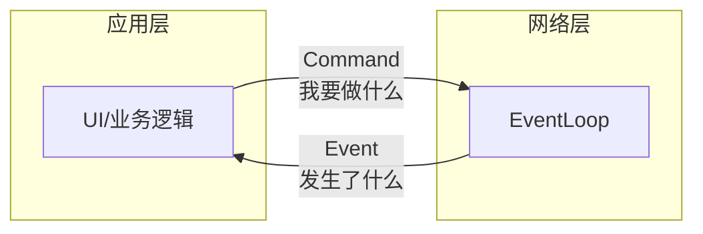
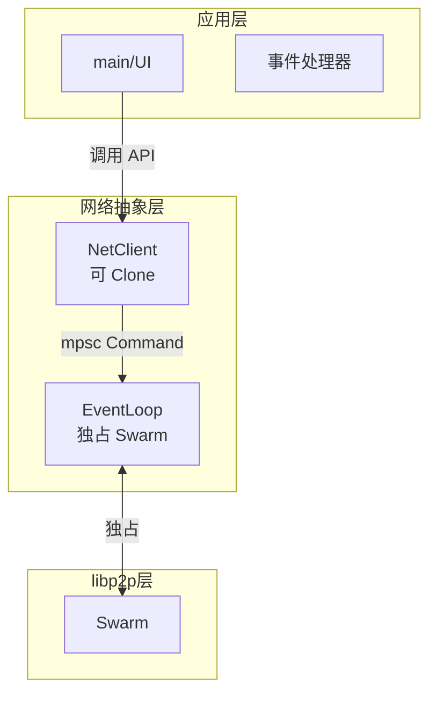
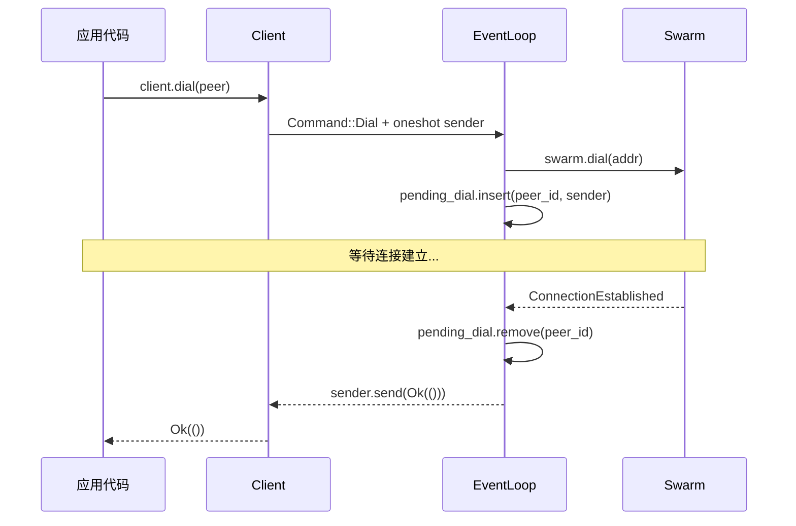

# Network 模块 v1：Command-Event 分离模式

> 本文记录网络模块的初版设计。后续发现该模式存在扩展性问题，已在 [03-network-command-trait](./03-network-module.md) 中重构。

## 背景

基于 libp2p 实现 P2P 网络层时，面临两个核心约束：

1. **Swarm 不能共享**：libp2p 的 Swarm 没有实现 Clone，无法在多处使用
2. **Swarm 需要持续 poll**：如果不持续驱动，网络事件无法处理

```rust
// ❌ 错误：Swarm 不是 Clone
let swarm_clone = swarm.clone();  // 编译错误！

// ❌ 错误：不 poll 就没有网络事件
swarm.dial(addr)?;
tokio::time::sleep(Duration::from_secs(5)).await;  // 连接永远不会建立
```

## 初版架构

采用经典的 Command-Event 分离模式：



### 核心组件



### Command 枚举

```rust
enum Command {
    Dial {
        peer_id: PeerId,
        addr: Multiaddr,
        sender: oneshot::Sender<Result<()>>,
    },
    Disconnect {
        peer_id: PeerId,
        sender: oneshot::Sender<Result<()>>,
    },
    // 每增加一个命令，就要加一个变体...
}
```

### Client 实现

```rust
#[derive(Clone)]
pub struct Client {
    sender: mpsc::Sender<Command>,
}

impl Client {
    pub async fn dial(&self, peer_id: PeerId, addr: Multiaddr) -> Result<()> {
        let (sender, receiver) = oneshot::channel();
        self.sender.send(Command::Dial { peer_id, addr, sender }).await?;
        receiver.await?
    }
}
```

### EventLoop 实现

```rust
pub struct EventLoop {
    swarm: Swarm<Behaviour>,
    command_receiver: mpsc::Receiver<Command>,
    pending_dial: HashMap<PeerId, oneshot::Sender<Result<()>>>,
    pending_disconnect: HashMap<PeerId, oneshot::Sender<Result<()>>>,
    // 每增加一个命令，就要加一个 pending HashMap...
}

impl EventLoop {
    pub async fn run(mut self) {
        loop {
            tokio::select! {
                event = self.swarm.select_next_some() => {
                    self.handle_event(event).await;
                }
                command = self.command_receiver.recv() => {
                    match command {
                        Some(cmd) => self.handle_command(cmd).await,
                        None => return,
                    }
                }
            }
        }
    }

    async fn handle_command(&mut self, cmd: Command) {
        match cmd {
            Command::Dial { peer_id, addr, sender } => {
                match self.swarm.dial(addr) {
                    Ok(()) => {
                        self.pending_dial.insert(peer_id, sender);
                    }
                    Err(e) => {
                        let _ = sender.send(Err(e.into()));
                    }
                }
            }
            Command::Disconnect { peer_id, sender } => {
                // 类似处理...
            }
        }
    }

    async fn handle_event(&mut self, event: SwarmEvent) {
        match event {
            SwarmEvent::ConnectionEstablished { peer_id, .. } => {
                if let Some(sender) = self.pending_dial.remove(&peer_id) {
                    let _ = sender.send(Ok(()));
                }
            }
            SwarmEvent::OutgoingConnectionError { peer_id, error, .. } => {
                if let Some(peer_id) = peer_id {
                    if let Some(sender) = self.pending_dial.remove(&peer_id) {
                        let _ = sender.send(Err(error.into()));
                    }
                }
            }
            // 每种事件都要手动匹配对应的 pending...
        }
    }
}
```

## 数据流



## 存在的问题

### 1. 扩展成本高

每增加一个新命令，需要修改 **4 处代码**：

1. `Command` 枚举添加变体
2. `EventLoop` 添加 `pending_*` HashMap
3. `handle_command` 添加 match 分支
4. `handle_event` 添加对应的事件处理

### 2. 状态分散

多个 `pending_*` HashMap 散落在 EventLoop 中，难以管理：

```rust
struct EventLoop {
    pending_dial: HashMap<PeerId, oneshot::Sender<Result<()>>>,
    pending_disconnect: HashMap<PeerId, oneshot::Sender<Result<()>>>,
    pending_request: HashMap<RequestId, oneshot::Sender<Result<Response>>>,
    // 越来越多...
}
```

### 3. 职责不清

命令逻辑散落在 EventLoop 的多个方法中：
- `handle_command` 负责发起操作
- `handle_event` 负责完成操作
- 两者通过 HashMap key 隐式关联

### 4. 事件处理冗长

`handle_event` 需要为每种事件判断属于哪个 pending 操作：

```rust
match event {
    SwarmEvent::ConnectionEstablished { peer_id, .. } => {
        // 可能是 dial 成功
        if let Some(sender) = self.pending_dial.remove(&peer_id) { ... }
    }
    SwarmEvent::ConnectionClosed { peer_id, .. } => {
        // 可能是 disconnect 成功
        if let Some(sender) = self.pending_disconnect.remove(&peer_id) { ... }
    }
    // 随着命令增多，这里会越来越复杂
}
```

## 改进方向

核心思路：**将命令逻辑内聚到命令自身**

- 每个命令知道自己需要什么事件
- 每个命令自己处理匹配的事件
- EventLoop 只负责分发，不关心具体逻辑

这个改进在 [03-network-module.md](./03-network-module.md) 中实现。
