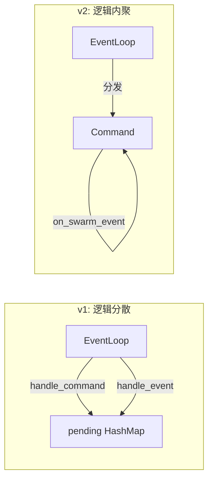
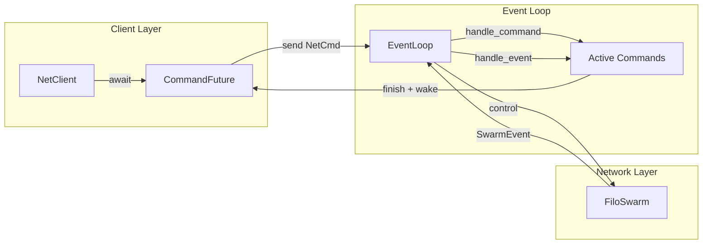
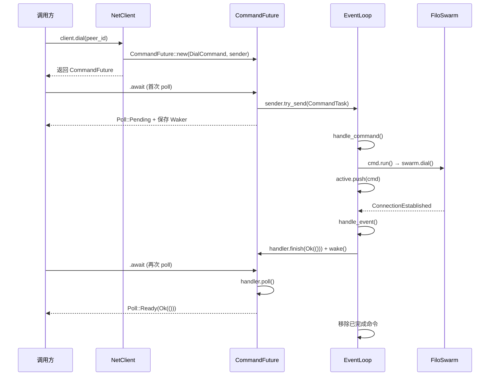
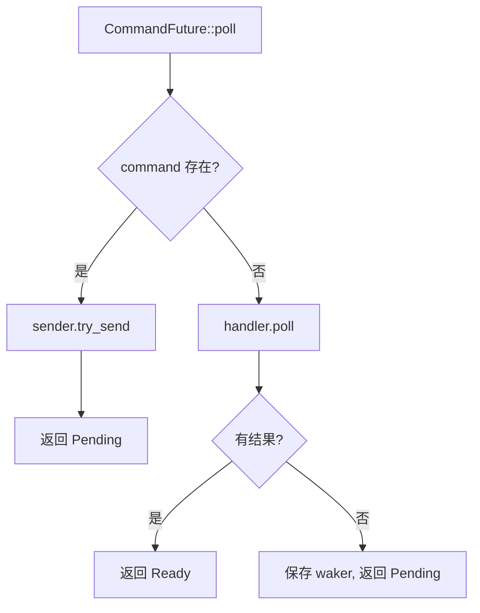

# Network 模块 v2：CommandHandler Trait 模式

> 本文记录网络模块的重构设计，解决了 [02-command-event-pattern](./02-command-event-pattern.md) 中的扩展性问题。

## 从 v1 到 v2

### v1 的问题回顾

初版采用 Command 枚举 + pending HashMap 模式，存在以下问题：

1. **扩展成本高**：每增加一个命令需要修改 4 处代码
2. **状态分散**：多个 `pending_*` HashMap 难以管理
3. **职责不清**：命令逻辑散落在 EventLoop 的多个方法中

### v2 的核心改进

**将命令逻辑内聚到命令自身**：



| 对比项 | v1 | v2 |
|--------|----|----|
| 命令定义 | 枚举变体 | 实现 trait 的 struct |
| 状态管理 | EventLoop 的 pending HashMap | 命令内部 + SharedStatHandle |
| 事件处理 | EventLoop 集中 match | 命令自己 match |
| 新增命令 | 改 4 处 | 只加一个文件 |

## 架构



### 核心组件

| 组件 | 文件 | 职责 |
|------|------|------|
| `NetClient` | `src/network/client.rs` | 对外 API，发送命令并返回 Future |
| `EventLoop` | `src/network/event_loop.rs` | 事件循环，驱动命令执行和事件分发 |
| `FiloSwarm` | `src/network/swarm.rs` | libp2p Swarm 封装 |
| `CommandHandler` | `src/network/commands/shared.rs` | 命令 trait |
| `CommandFuture` | `src/network/commands/future.rs` | 将命令包装为 Future |
| `SharedStatHandle` | `src/network/commands/shared.rs` | 共享状态句柄 |

## 命令执行流程



## 核心组件详解

### CommandHandler trait

每个命令实现这个 trait，定义自己的执行逻辑和事件处理：

```rust
#[async_trait]
pub trait CommandHandler {
    type Result: Any;

    /// 命令启动时调用（触发 swarm 操作）
    async fn run(&mut self, swarm: &mut FiloSwarm, handler: &SharedStatHandle<Self::Result>);

    /// 处理 swarm 事件
    /// 返回 true = 继续等待，false = 命令完成
    async fn on_swarm_event(
        &mut self,
        event: &SwarmEvent<FiloBehaviourEvent>,
        handler: &SharedStatHandle<Self::Result>,
    ) -> bool;
}
```

### SharedStatHandle - 共享状态句柄

替代 v1 的 oneshot channel，用于 Future 和 EventLoop 之间的通信：

```rust
pub struct SharedState<T> {
    pub result: Option<Result<T>>,
    pub waker: Option<Waker>,
}

pub struct SharedStatHandle<T>(Arc<Mutex<SharedState<T>>>);

impl<T> SharedStatHandle<T> {
    /// Future 调用：检查结果或保存 waker
    pub fn poll(&self, ctx: &Context<'_>) -> Poll<Result<T>>;

    /// 命令调用：写入结果并唤醒 Future
    pub async fn finish(&self, result: Result<T>);
}
```

### CommandFuture - 惰性发送

命令在首次 `poll` 时才发送到 EventLoop，符合 Rust Future 的惰性语义：



### EventLoop - 简化

不再需要多个 pending HashMap，只维护一个 active 命令列表：

```rust
pub struct EventLoop {
    swarm: FiloSwarm,
    command_receiver: mpsc::Receiver<NetCmd>,
    active: Vec<NetCmd>,  // 所有活跃命令
}

impl EventLoop {
    pub async fn handle_command(&mut self, mut cmd: NetCmd) {
        cmd.run(&mut self.swarm).await;
        self.active.push(cmd);
    }

    pub async fn handle_event(&mut self, event: SwarmEvent<FiloBehaviourEvent>) {
        // 异步版本的 retain
        let mut i = 0;
        while i < self.active.len() {
            if self.active[i].on_swarm_event(&event).await {
                i += 1;  // 继续等待
            } else {
                self.active.swap_remove(i);  // 命令完成，移除
            }
        }
    }
}
```

## 添加新命令

只需要一个文件，实现 CommandHandler trait：

```rust
// src/network/commands/my_command.rs
use anyhow::anyhow;
use async_trait::async_trait;
use crate::network::commands::{CommandHandler, SharedStatHandle};

#[derive(Debug)]
pub struct MyCommand {
    // 命令参数
}

impl MyCommand {
    pub fn new(/* params */) -> Self {
        Self { /* ... */ }
    }
}

#[async_trait]
impl CommandHandler for MyCommand {
    type Result = ();

    async fn run(
        &mut self,
        swarm: &mut FiloSwarm,
        handler: &SharedStatHandle<Self::Result>,
    ) {
        // 执行 swarm 操作
        if let Err(e) = swarm.some_operation() {
            handler.finish(Err(anyhow!("error: {e}").into())).await;
        }
    }

    async fn on_swarm_event(
        &mut self,
        event: &SwarmEvent<FiloBehaviourEvent>,
        handler: &SharedStatHandle<Self::Result>,
    ) -> bool {
        match event {
            SwarmEvent::SomeEvent { .. } => {
                handler.finish(Ok(())).await;
                false  // 命令完成
            }
            _ => true,  // 继续等待
        }
    }
}
```

在 NetClient 中添加方法：

```rust
impl NetClient {
    pub async fn my_command(&self, /* params */) -> Result<()> {
        let cmd = MyCommand::new(/* params */);
        CommandFuture::new(cmd, self.tx.clone()).await?;
        Ok(())
    }
}
```

导出模块（`commands/mod.rs`）：

```rust
mod my_command;
pub use my_command::*;
```

## 已实现命令

| 命令 | 文件 | 功能 | 成功事件 | 失败事件 |
|------|------|------|----------|----------|
| `DialCommand` | `commands/dial.rs` | 连接到指定 peer | `ConnectionEstablished` | `OutgoingConnectionError` |
| `CloseCommand` | `commands/close.rs` | 断开连接 | `ConnectionClosed` | 立即返回错误 |

## 注意事项

### 确保命令完成

命令必须在所有代码路径下调用 `handler.finish()`，否则 Future 会永远 Pending。

### 异步 retain

标准 `retain_mut` 不支持异步闭包，需要手动实现 while 循环。

### on_swarm_event 返回值

- `true`：继续等待更多事件
- `false`：命令完成，从 active 列表移除

## 待办

- [ ] 添加命令超时支持
- [ ] 实现取消机制
- [ ] 添加更多网络命令（如 request-response）
