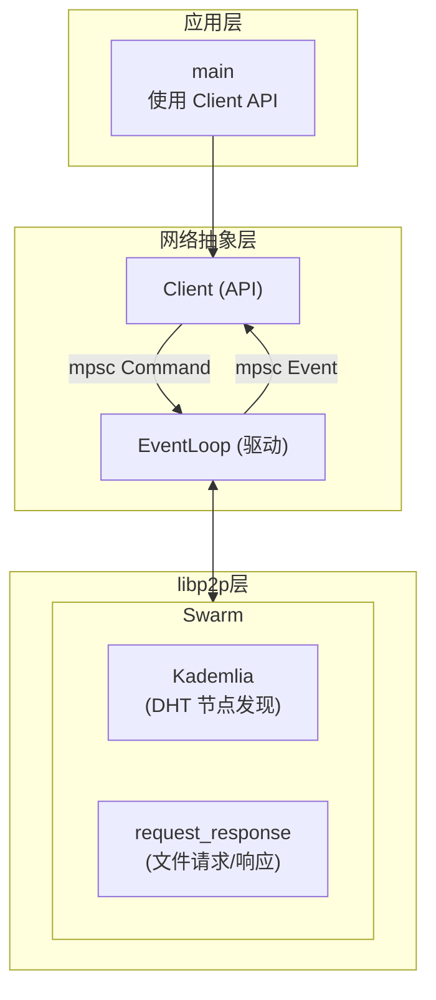
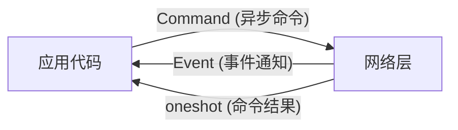
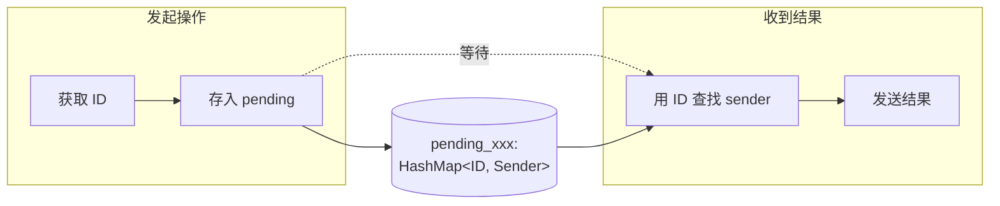
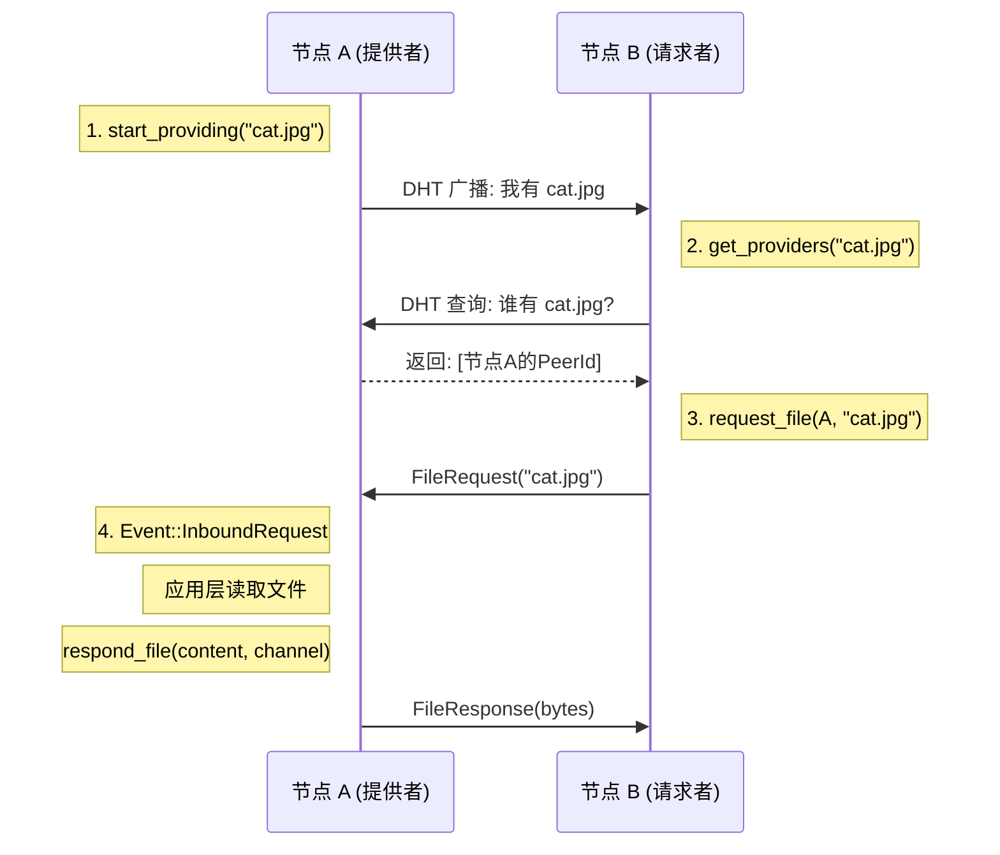

# libp2p 文件交换示例详解

这是一个使用 Kademlia DHT + request-response 实现分布式文件共享的示例，展示了生产级 P2P 应用的架构模式。

## 整体架构



## 核心设计模式：Command-Event 分离

这个示例的精髓在于将网络操作与业务逻辑完全解耦：



## 代码逐段解析

### 1. 网络行为定义

```rust
#[derive(NetworkBehaviour)]
struct Behaviour {
    request_response: request_response::cbor::Behaviour<FileRequest, FileResponse>,
    kademlia: kad::Behaviour<kad::store::MemoryStore>,
}
```

组合两个行为：
- `kademlia`: 分布式哈希表，用于发现"谁有这个文件"
- `request_response`: 点对点请求响应，用于实际获取文件

### 2. 请求/响应消息定义

```rust
#[derive(Debug, Clone, PartialEq, Eq, Serialize, Deserialize)]
struct FileRequest(String);  // 请求的文件名

#[derive(Debug, Clone, PartialEq, Eq, Serialize, Deserialize)]
pub(crate) struct FileResponse(Vec<u8>);  // 文件内容
```

使用 `serde` 序列化，配合 `request_response::cbor::Behaviour` 自动编解码。

### 3. 命令枚举

```rust
enum Command {
    StartListening { addr, sender },      // 开始监听
    Dial { peer_id, peer_addr, sender },  // 连接节点
    StartProviding { file_name, sender }, // 宣布"我有这个文件"
    GetProviders { file_name, sender },   // 查询"谁有这个文件"
    RequestFile { file_name, peer, sender }, // 向某节点请求文件
    RespondFile { file, channel },        // 响应文件请求
}
```

每个命令都带有 `oneshot::Sender`，用于返回操作结果。

### 4. 事件枚举

```rust
pub(crate) enum Event {
    InboundRequest {
        request: String,                    // 请求的文件名
        channel: ResponseChannel<FileResponse>, // 用于发送响应
    },
}
```

目前只有一种事件：收到文件请求。应用层收到后决定如何响应。

### 5. 初始化函数

```rust
pub(crate) async fn new(
    secret_key_seed: Option<u8>,
) -> Result<(Client, impl Stream<Item = Event>, EventLoop), Box<dyn Error>>
```

返回三个组件：
- `Client`: 供应用层调用的 API
- `Stream<Item = Event>`: 事件流，应用层监听
- `EventLoop`: 需要 spawn 运行的网络驱动

### 6. Swarm 创建

```rust
let mut swarm = libp2p::SwarmBuilder::with_existing_identity(id_keys)
    .with_tokio()
    .with_tcp(tcp::Config::default(), noise::Config::new, yamux::Config::default)?
    .with_behaviour(|key| Behaviour {
        kademlia: kad::Behaviour::new(
            peer_id,
            kad::store::MemoryStore::new(key.public().to_peer_id()),
        ),
        request_response: request_response::cbor::Behaviour::new(
            [(StreamProtocol::new("/file-exchange/1"), ProtocolSupport::Full)],
            request_response::Config::default(),
        ),
    })?
    .with_swarm_config(|c| c.with_idle_connection_timeout(Duration::from_secs(60)))
    .build();

// 设置 Kademlia 为服务器模式（主动响应查询）
swarm.behaviour_mut().kademlia.set_mode(Some(kad::Mode::Server));
```

### 7. Client API 实现

```rust
impl Client {
    pub(crate) async fn start_listening(&mut self, addr: Multiaddr) -> Result<...> {
        let (sender, receiver) = oneshot::channel();
        self.sender
            .send(Command::StartListening { addr, sender })
            .await
            .expect("Command receiver not to be dropped.");
        receiver.await.expect("Sender not to be dropped.")
    }
    // ... 其他方法类似
}
```

模式：
1. 创建 oneshot channel
2. 发送 Command（带上 sender）
3. 等待 receiver 返回结果

这样应用层可以用 `await` 等待异步操作完成。

### 8. EventLoop 核心循环

```rust
pub(crate) async fn run(mut self) {
    loop {
        tokio::select! {
            // 处理网络事件
            event = self.swarm.select_next_some() => self.handle_event(event).await,
            // 处理应用命令
            command = self.command_receiver.next() => match command {
                Some(c) => self.handle_command(c).await,
                None => return,  // channel 关闭，退出
            },
        }
    }
}
```

使用 `tokio::select!` 同时监听：
- Swarm 事件（网络层）
- Command（应用层）

### 9. 处理命令

```rust
async fn handle_command(&mut self, command: Command) {
    match command {
        Command::StartListening { addr, sender } => {
            let _ = match self.swarm.listen_on(addr) {
                Ok(_) => sender.send(Ok(())),
                Err(e) => sender.send(Err(Box::new(e))),
            };
        }
        Command::Dial { peer_id, peer_addr, sender } => {
            // 先添加到 Kademlia 路由表
            self.swarm.behaviour_mut().kademlia.add_address(&peer_id, peer_addr.clone());
            // 然后 dial
            match self.swarm.dial(peer_addr.with(Protocol::P2p(peer_id))) {
                Ok(()) => { self.pending_dial.insert(peer_id, sender); }
                Err(e) => { sender.send(Err(Box::new(e))); }
            }
        }
        Command::StartProviding { file_name, sender } => {
            let query_id = self.swarm.behaviour_mut().kademlia
                .start_providing(file_name.into_bytes().into())
                .expect("No store error.");
            self.pending_start_providing.insert(query_id, sender);
        }
        Command::GetProviders { file_name, sender } => {
            let query_id = self.swarm.behaviour_mut().kademlia
                .get_providers(file_name.into_bytes().into());
            self.pending_get_providers.insert(query_id, sender);
        }
        Command::RequestFile { file_name, peer, sender } => {
            let request_id = self.swarm.behaviour_mut().request_response
                .send_request(&peer, FileRequest(file_name));
            self.pending_request_file.insert(request_id, sender);
        }
        Command::RespondFile { file, channel } => {
            self.swarm.behaviour_mut().request_response
                .send_response(channel, FileResponse(file))
                .expect("Connection to peer to be still open.");
        }
    }
}
```

关键点：
- 异步操作（dial、DHT 查询）会返回一个 ID
- 将 ID 和 oneshot sender 存入 pending HashMap
- 等事件返回时，用 ID 找到对应的 sender 发送结果

### 10. 处理事件

```rust
async fn handle_event(&mut self, event: SwarmEvent<BehaviourEvent>) {
    match event {
        // Kademlia: StartProviding 完成
        SwarmEvent::Behaviour(BehaviourEvent::Kademlia(
            kad::Event::OutboundQueryProgressed {
                id,
                result: kad::QueryResult::StartProviding(_),
                ..
            },
        )) => {
            let sender = self.pending_start_providing.remove(&id).unwrap();
            let _ = sender.send(());
        }

        // Kademlia: GetProviders 找到提供者
        SwarmEvent::Behaviour(BehaviourEvent::Kademlia(
            kad::Event::OutboundQueryProgressed {
                id,
                result: kad::QueryResult::GetProviders(Ok(
                    kad::GetProvidersOk::FoundProviders { providers, .. }
                )),
                ..
            },
        )) => {
            if let Some(sender) = self.pending_get_providers.remove(&id) {
                sender.send(providers).unwrap();
                // 只要第一个结果，立即结束查询
                self.swarm.behaviour_mut().kademlia.query_mut(&id).unwrap().finish();
            }
        }

        // request_response: 收到请求
        SwarmEvent::Behaviour(BehaviourEvent::RequestResponse(
            request_response::Event::Message {
                message: request_response::Message::Request { request, channel, .. },
                ..
            },
        )) => {
            // 转发给应用层处理
            self.event_sender
                .send(Event::InboundRequest {
                    request: request.0,
                    channel,
                })
                .await
                .unwrap();
        }

        // request_response: 收到响应
        SwarmEvent::Behaviour(BehaviourEvent::RequestResponse(
            request_response::Event::Message {
                message: request_response::Message::Response { request_id, response },
                ..
            },
        )) => {
            let sender = self.pending_request_file.remove(&request_id).unwrap();
            let _ = sender.send(Ok(response.0));
        }

        // 连接建立成功
        SwarmEvent::ConnectionEstablished { peer_id, endpoint, .. } => {
            if endpoint.is_dialer() {
                if let Some(sender) = self.pending_dial.remove(&peer_id) {
                    let _ = sender.send(Ok(()));
                }
            }
        }

        // 连接失败
        SwarmEvent::OutgoingConnectionError { peer_id, error, .. } => {
            if let Some(peer_id) = peer_id {
                if let Some(sender) = self.pending_dial.remove(&peer_id) {
                    let _ = sender.send(Err(Box::new(error)));
                }
            }
        }
        // ...
    }
}
```

## Pending HashMap 模式

这是处理异步操作的核心模式：



示例中有 4 个 pending HashMap：
- `pending_dial`: 等待连接建立
- `pending_start_providing`: 等待 DHT 发布完成
- `pending_get_providers`: 等待 DHT 查询结果
- `pending_request_file`: 等待文件响应

## 文件共享流程



## 使用示例

```rust
#[tokio::main]
async fn main() {
    let (mut client, mut events, event_loop) = new(None).await.unwrap();

    // 启动网络事件循环
    tokio::spawn(event_loop.run());

    // 开始监听
    client.start_listening("/ip4/0.0.0.0/tcp/0".parse().unwrap()).await.unwrap();

    // 处理事件
    tokio::spawn(async move {
        while let Some(event) = events.next().await {
            match event {
                Event::InboundRequest { request, channel } => {
                    // 读取文件并响应
                    let content = std::fs::read(&request).unwrap_or_default();
                    client.respond_file(content, channel).await;
                }
            }
        }
    });

    // 宣布提供文件
    client.start_providing("my_file.txt".to_string()).await;

    // 查找并下载文件
    let providers = client.get_providers("some_file.txt".to_string()).await;
    for peer in providers {
        match client.request_file(peer, "some_file.txt".to_string()).await {
            Ok(content) => {
                std::fs::write("downloaded.txt", content).unwrap();
                break;
            }
            Err(e) => eprintln!("Failed: {e}"),
        }
    }
}
```

## 核心概念总结

| 概念 | 说明 |
|------|------|
| `Client` | 应用层 API，通过 channel 发送命令 |
| `EventLoop` | 网络驱动，处理命令和事件 |
| `Command` | 应用→网络的操作请求 |
| `Event` | 网络→应用的事件通知 |
| `oneshot` | 单次结果返回通道 |
| `pending_*` | 跟踪异步操作的 HashMap |
| Kademlia | DHT，用于发现文件提供者 |
| request_response | 点对点请求响应协议 |

## 与 Echo 示例的对比

| 特性 | Echo 示例 | 文件交换示例 |
|------|----------|-------------|
| 架构 | 简单直接 | Command-Event 分离 |
| 协议 | Stream（字节流） | request_response（消息） |
| 发现 | 手动指定地址 | Kademlia DHT |
| 适用 | 学习/简单场景 | 生产级应用 |
| 复杂度 | 低 | 中高 |

## 在 Filo 中的应用建议

这个架构非常适合 Filo 的文件同步：

1. **替换 Kademlia 为 mDNS**: 局域网场景不需要 DHT
2. **保留 request_response**: 用于文件块请求
3. **保留 Command-Event 模式**: 解耦 UI 和网络层
4. **添加 GossipSub**: 用于广播文件变更通知

```rust
#[derive(NetworkBehaviour)]
struct FiloBehaviour {
    mdns: mdns::tokio::Behaviour,           // 局域网发现
    gossipsub: gossipsub::Behaviour,        // 变更广播
    request_response: request_response::cbor::Behaviour<SyncRequest, SyncResponse>,
}
```
