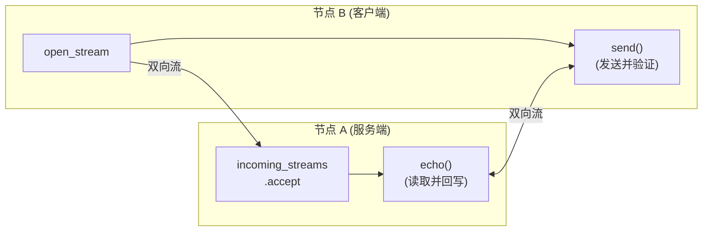

# libp2p-stream Echo 示例详解

这是一个使用 `libp2p-stream` 实现 Echo 协议的示例，展示了如何在 P2P 网络中进行双向流式通信。

## 整体架构



## 代码逐段解析

### 1. 依赖引入

```rust
use std::{io, time::Duration};
use anyhow::{Context, Result};
use futures::{AsyncReadExt, AsyncWriteExt, StreamExt};
use libp2p::{multiaddr::Protocol, Multiaddr, PeerId, Stream, StreamProtocol};
use libp2p_stream as stream;
```

- `futures::{AsyncReadExt, AsyncWriteExt}`: 提供 `.read()` 和 `.write_all()` 等异步读写方法
- `StreamExt`: 提供 `.next()` 方法用于迭代异步流
- `libp2p::Stream`: libp2p 的双向流类型，实现了 `AsyncRead + AsyncWrite`
- `libp2p_stream`: 独立的流处理 crate，提供轻量级的流管理

### 2. 协议定义

```rust
const ECHO_PROTOCOL: StreamProtocol = StreamProtocol::new("/echo");
```

- 协议标识符，类似 HTTP 的路径
- 双方必须使用相同的协议名才能建立流
- 命名惯例：`/项目名/功能/版本`，如 `/filo/file-transfer/1.0.0`

### 3. Swarm 创建

```rust
let mut swarm = libp2p::SwarmBuilder::with_new_identity()
    .with_tokio()
    .with_quic()  // 使用 QUIC 传输
    .with_behaviour(|_| stream::Behaviour::new())?
    .with_swarm_config(|c| c.with_idle_connection_timeout(Duration::from_secs(10)))
    .build();
```

关键点：
- `with_quic()`: 使用 QUIC 协议（基于 UDP），比 TCP 更适合 P2P
- `stream::Behaviour::new()`: 使用 `libp2p_stream` 的行为，非常轻量
- `idle_connection_timeout`: 空闲连接 10 秒后自动断开

### 4. 开始监听

```rust
swarm.listen_on("/ip4/127.0.0.1/udp/0/quic-v1".parse()?)?;
```

- `/ip4/127.0.0.1`: IPv4 本地地址
- `/udp/0`: UDP 端口 0 表示让系统自动分配
- `/quic-v1`: 使用 QUIC v1 协议

### 5. 服务端：注册协议并接受流

```rust
let mut incoming_streams = swarm
    .behaviour()
    .new_control()      // 获取流控制器
    .accept(ECHO_PROTOCOL)  // 注册接受该协议的流
    .unwrap();
```

- `new_control()`: 创建一个 `Control` 实例，可以克隆并在多个任务间共享
- `accept(protocol)`: 注册要接受的协议，返回 `IncomingStreams` 迭代器
- 每个协议只能调用一次 `accept()`，重复调用会返回 `None`

### 6. 服务端：处理传入流的任务

```rust
tokio::spawn(async move {
    while let Some((peer, stream)) = incoming_streams.next().await {
        match echo(stream).await {
            Ok(n) => tracing::info!(%peer, "Echoed {n} bytes!"),
            Err(e) => tracing::warn!(%peer, "Echo failed: {e}"),
        };
    }
});
```

重要注意事项（来自注释）：
- **必须处理传入流**：libp2p 会在应用处理不过来时丢弃流，防止 DoS
- **顺序 vs 并行**：示例是顺序处理，也可以为每个流 spawn 新任务
- **背压问题**：spawn 新任务 = 无界缓冲，可能被恶意节点耗尽内存

### 7. 客户端：解析地址并连接

```rust
if let Some(address) = maybe_address {
    // 从地址末尾提取 PeerId
    let Some(Protocol::P2p(peer_id)) = address.iter().last() else {
        anyhow::bail!("Provided address does not end in `/p2p`");
    };

    swarm.dial(address)?;  // 建立连接

    tokio::spawn(connection_handler(peer_id, swarm.behaviour().new_control()));
}
```

- 地址格式：`/ip4/127.0.0.1/udp/12345/quic-v1/p2p/12D3KooW...`
- `Protocol::P2p(peer_id)`: 从 Multiaddr 中提取 PeerId
- `swarm.dial()`: 建立底层连接（TCP/QUIC）
- 连接建立后，spawn 一个任务来处理流通信

### 8. 客户端：连接处理器

```rust
async fn connection_handler(peer: PeerId, mut control: stream::Control) {
    loop {
        tokio::time::sleep(Duration::from_secs(1)).await;

        let stream = match control.open_stream(peer, ECHO_PROTOCOL).await {
            Ok(stream) => stream,
            Err(error @ stream::OpenStreamError::UnsupportedProtocol(_)) => {
                // 对方不支持该协议，退出
                tracing::info!(%peer, %error);
                return;
            }
            Err(error) => {
                // 其他错误可能是临时的，继续重试
                tracing::debug!(%peer, %error);
                continue;
            }
        };

        if let Err(e) = send(stream).await {
            tracing::warn!(%peer, "Echo protocol failed: {e}");
            continue;
        }

        tracing::info!(%peer, "Echo complete!")
    }
}
```

- `control.open_stream(peer, protocol)`: 向指定 peer 打开一个流
- 错误处理：
  - `UnsupportedProtocol`: 对方不支持，应该停止重试
  - 其他错误：可能是网络问题，可以重试（生产环境建议用指数退避）

### 9. 主事件循环

```rust
loop {
    let event = swarm.next().await.expect("never terminates");

    match event {
        libp2p::swarm::SwarmEvent::NewListenAddr { address, .. } => {
            // 打印监听地址，供其他节点连接
            let listen_address = address.with_p2p(*swarm.local_peer_id()).unwrap();
            tracing::info!(%listen_address);
        }
        event => tracing::trace!(?event),
    }
}
```

- 必须持续 poll swarm 才能处理网络事件
- `NewListenAddr`: 当开始监听时触发，打印完整地址（包含 PeerId）

### 10. Echo 函数（服务端）

```rust
async fn echo(mut stream: Stream) -> io::Result<usize> {
    let mut total = 0;
    let mut buf = [0u8; 100];

    loop {
        let read = stream.read(&mut buf).await?;
        if read == 0 {
            return Ok(total);  // 对方关闭了流
        }

        total += read;
        stream.write_all(&buf[..read]).await?;  // 原样写回
    }
}
```

- `read() == 0`: 表示对方关闭了写端（EOF）
- `write_all()`: 确保所有数据都写入

### 11. Send 函数（客户端）

```rust
async fn send(mut stream: Stream) -> io::Result<()> {
    // 生成随机长度的随机数据
    let num_bytes = rand::random::<usize>() % 1000;
    let mut bytes = vec![0; num_bytes];
    rand::thread_rng().fill_bytes(&mut bytes);

    // 发送数据
    stream.write_all(&bytes).await?;

    // 读取回显并验证
    let mut buf = vec![0; num_bytes];
    stream.read_exact(&mut buf).await?;

    if bytes != buf {
        return Err(io::Error::other("incorrect echo"));
    }

    // 关闭流
    stream.close().await?;

    Ok(())
}
```

- `read_exact()`: 确保读取指定数量的字节
- `stream.close()`: 优雅关闭流，通知对方 EOF

## 运行方式

```bash
# 终端 1：启动服务端
cargo run
# 输出：listen_address=/ip4/127.0.0.1/udp/xxxxx/quic-v1/p2p/12D3KooW...

# 终端 2：启动客户端
cargo run -- /ip4/127.0.0.1/udp/xxxxx/quic-v1/p2p/12D3KooW...
```

## 核心概念总结

| 概念 | 说明 |
|------|------|
| `stream::Behaviour` | 轻量级流管理行为，不像 GossipSub 那样复杂 |
| `Control` | 流控制器，可克隆，用于打开/接受流 |
| `accept(protocol)` | 服务端注册协议，返回传入流的迭代器 |
| `open_stream(peer, protocol)` | 客户端向指定 peer 打开流 |
| `Stream` | 双向流，实现 `AsyncRead + AsyncWrite` |
| 背压 | libp2p 自动丢弃处理不过来的流，防止 DoS |

## 与其他方式的对比

| 特性 | Stream | GossipSub | request-response |
|------|--------|-----------|------------------|
| 通信模式 | 点对点双向流 | 发布订阅广播 | 请求-响应 |
| 适用场景 | 大文件传输 | 元数据同步 | 小数据交换 |
| 复杂度 | 低 | 中 | 中 |
| 背压控制 | 手动 | 自动 | 自动 |
| 消息边界 | 无（字节流） | 有 | 有 |

## 在 Filo 中的应用建议

对于文件同步场景：

1. **设备发现/在线状态**: 使用 GossipSub
2. **文件元数据同步**: 使用 GossipSub 或 request-response
3. **文件内容传输**: 使用 Stream（本示例的方式）

Stream 的优势：
- 可以传输任意大小的数据
- 支持流式传输，不需要一次性加载到内存
- 可以实现断点续传
