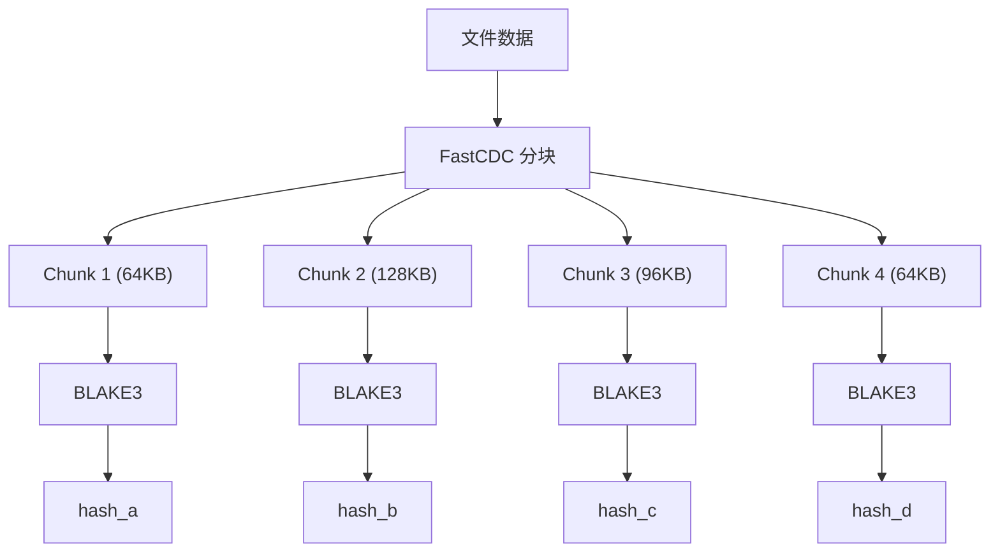
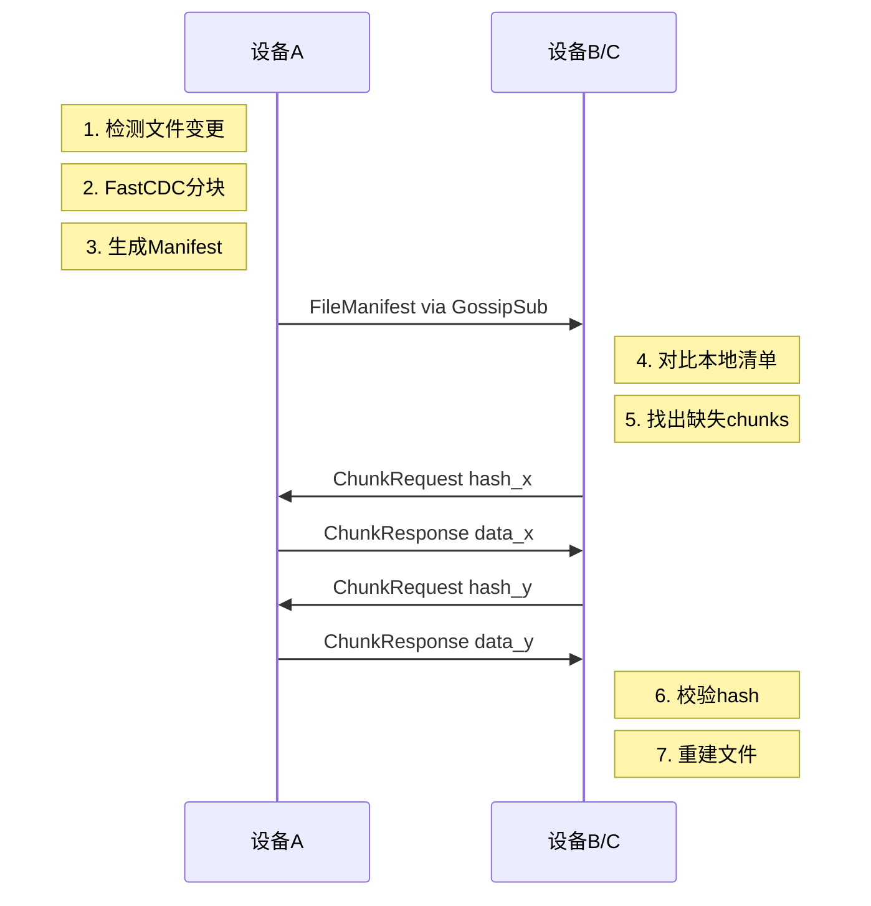
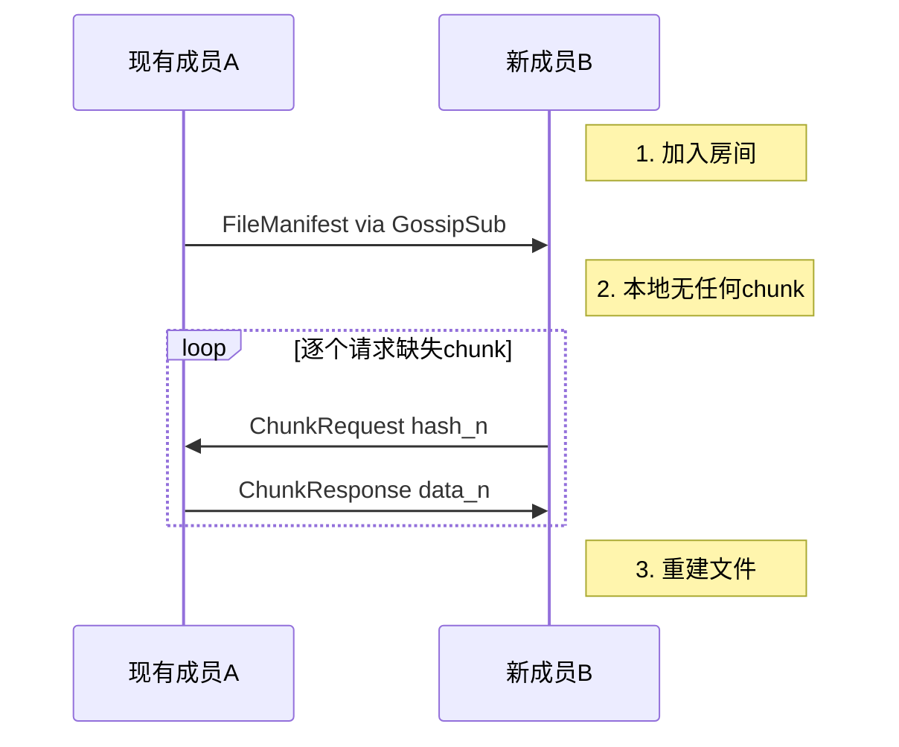

# Filo 文件同步设计文档

**基于 FastCDC + BLAKE3 的增量文件同步**
*版本 1.0 — 2025 年 12 月*

---

## 一、概述

### 1.1 设计目标

| 目标 | 说明 |
|------|------|
| **增量同步** | 文件变更时只传输变化的部分 |
| **内容寻址** | 相同内容只存储/传输一份 |
| **高效传输** | 大文件分块，支持并行传输 |
| **数据完整性** | BLAKE3 哈希校验每个分块 |

### 1.2 技术选型

| 组件 | 技术 | 说明 |
|------|------|------|
| **分块算法** | FastCDC | 内容定义分块，变更局部化 |
| **哈希算法** | BLAKE3 | 高性能，安全性好 |
| **清单同步** | GossipSub | 广播给房间所有成员 |
| **数据传输** | request-response | 点对点请求/响应模式 |

---

## 二、分块策略

### 2.1 FastCDC 参数

```rust
const MIN_CHUNK: u32 = 16 * 1024;    // 16KB
const AVG_CHUNK: u32 = 64 * 1024;    // 64KB
const MAX_CHUNK: u32 = 256 * 1024;   // 256KB
```

### 2.2 分块原理



**FastCDC 优势：**
- 基于内容边界分块，插入/删除只影响局部
- 相比固定分块，变更时产生的差异更小

---

## 三、数据结构

### 3.1 Chunk

```rust
#[derive(Clone, Serialize, Deserialize)]
pub struct Chunk {
    /// BLAKE3 哈希（32字节）
    pub hash: [u8; 32],
    /// 原始数据
    pub data: Vec<u8>,
}
```

### 3.2 FileManifest

```rust
#[derive(Clone, Serialize, Deserialize)]
pub struct FileManifest {
    /// 文件路径（相对于工作区）
    pub path: String,
    /// 有序的 chunk hash 列表
    pub chunks: Vec<[u8; 32]>,
    /// 文件总大小
    pub total_size: u64,
    /// 修改时间戳
    pub modified_at: u64,
}
```

---

## 四、协议设计

### 4.1 协议分层

| 层级 | 协议 | 用途 |
|------|------|------|
| **清单层** | GossipSub | 广播文件清单变更 |
| **传输层** | request-response | 点对点传输 chunk 数据 |

### 4.2 为什么混合使用

| 数据类型 | 协议 | 原因 |
|----------|------|------|
| Manifest | GossipSub | 体积小（几KB），需通知所有协作者 |
| Chunk | request-response | 一问一答模式，简单可靠 |

### 4.3 消息定义

**GossipSub 消息（扩展 FiloMessage）：**

```rust
pub enum FiloMessage {
    // ... 现有消息类型

    /// 文件清单更新
    FileManifest(FileManifest),

    /// 文件删除通知
    FileDeleted { path: String },
}
```

**request-response 协议：**

```rust
/// 协议名: /filo/file/1.0.0

/// 请求：获取单个 chunk
#[derive(Debug, Clone, Serialize, Deserialize)]
pub struct ChunkRequest {
    pub hash: [u8; 32],
}

/// 响应：返回 chunk 数据
#[derive(Debug, Clone, Serialize, Deserialize)]
pub struct ChunkResponse {
    pub hash: [u8; 32],
    pub data: Vec<u8>,
}
```

---

## 五、同步流程

### 5.1 文件变更同步



### 5.2 新成员加入同步



---

## 六、实现

### 6.1 分块与哈希

```rust
use blake3;
use fastcdc::v2020::FastCDC;

pub fn chunk_file(data: &[u8]) -> (FileManifest, Vec<Chunk>) {
    let chunker = FastCDC::new(data, MIN_CHUNK, AVG_CHUNK, MAX_CHUNK);
    let mut chunks = Vec::new();
    let mut hashes = Vec::new();

    for entry in chunker {
        let chunk_data = &data[entry.offset..entry.offset + entry.length];
        let hash = blake3::hash(chunk_data);
        hashes.push(*hash.as_bytes());
        chunks.push(Chunk {
            hash: *hash.as_bytes(),
            data: chunk_data.to_vec(),
        });
    }

    (FileManifest {
        path: String::new(),
        chunks: hashes,
        total_size: data.len() as u64,
        modified_at: 0,
    }, chunks)
}
```

### 6.2 差异计算

```rust
use std::collections::HashSet;

pub fn diff_manifests(local: &FileManifest, remote: &FileManifest) -> Vec<[u8; 32]> {
    let local_set: HashSet<_> = local.chunks.iter().collect();
    remote.chunks.iter()
        .filter(|h| !local_set.contains(h))
        .copied()
        .collect()
}
```

### 6.3 文件重建

```rust
use std::collections::HashMap;

pub fn reassemble(manifest: &FileManifest, chunks: &HashMap<[u8; 32], Vec<u8>>) -> Vec<u8> {
    manifest.chunks.iter()
        .flat_map(|h| chunks.get(h).unwrap().clone())
        .collect()
}
```

### 6.4 request-response 协议

```rust
use libp2p::request_response::{self, Codec, ProtocolSupport};
use async_trait::async_trait;

const PROTOCOL: &str = "/filo/file/1.0.0";

/// 编解码器
#[derive(Clone, Default)]
pub struct ChunkCodec;

#[async_trait]
impl Codec for ChunkCodec {
    type Protocol = &'static str;
    type Request = ChunkRequest;
    type Response = ChunkResponse;

    async fn read_request<T>(&mut self, _: &Self::Protocol, io: &mut T) -> io::Result<Self::Request>
    where T: AsyncRead + Unpin + Send {
        let mut buf = Vec::new();
        io.read_to_end(&mut buf).await?;
        bincode::deserialize(&buf).map_err(|e| io::Error::new(io::ErrorKind::InvalidData, e))
    }

    async fn read_response<T>(&mut self, _: &Self::Protocol, io: &mut T) -> io::Result<Self::Response>
    where T: AsyncRead + Unpin + Send {
        let mut buf = Vec::new();
        io.read_to_end(&mut buf).await?;
        bincode::deserialize(&buf).map_err(|e| io::Error::new(io::ErrorKind::InvalidData, e))
    }

    async fn write_request<T>(&mut self, _: &Self::Protocol, io: &mut T, req: Self::Request) -> io::Result<()>
    where T: AsyncWrite + Unpin + Send {
        let data = bincode::serialize(&req).map_err(|e| io::Error::new(io::ErrorKind::InvalidData, e))?;
        io.write_all(&data).await
    }

    async fn write_response<T>(&mut self, _: &Self::Protocol, io: &mut T, res: Self::Response) -> io::Result<()>
    where T: AsyncWrite + Unpin + Send {
        let data = bincode::serialize(&res).map_err(|e| io::Error::new(io::ErrorKind::InvalidData, e))?;
        io.write_all(&data).await
    }
}

/// 创建 Behaviour
pub fn new_behaviour() -> request_response::Behaviour<ChunkCodec> {
    request_response::Behaviour::new(
        [(PROTOCOL, ProtocolSupport::Full)],
        request_response::Config::default(),
    )
}
```

### 6.5 添加到 FiloBehaviour

```rust
#[derive(NetworkBehaviour)]
pub struct FiloBehaviour {
    pub mdns: mdns::tokio::Behaviour,
    pub gossipsub: gossipsub::Behaviour,
    pub identify: identify::Behaviour,
    pub file_transfer: request_response::Behaviour<ChunkCodec>,  // 新增
}
```

---

## 七、存储结构

### 7.1 本地存储

```
~/.filo/
├── chunks/                    # Chunk 存储（按 hash 命名）
│   ├── ab/
│   │   └── ab3f7c...          # hash 前2字符作为目录
│   └── cd/
│       └── cd9e1a...
├── manifests/                 # 文件清单
│   └── {room_code}/
│       └── {file_path}.manifest
└── index.db                   # 索引数据库（可选）
```

### 7.2 Chunk 去重

相同内容的 chunk 只存储一份，多个文件可共享：

```
文件 A: [hash_1, hash_2, hash_3]
文件 B: [hash_2, hash_3, hash_4]  # hash_2, hash_3 复用
```

---

## 八、依赖

```toml
[dependencies]
fastcdc = "3"
blake3 = "1.5"
bincode = "1.3"
async-trait = "0.1"
libp2p = { version = "0.54", features = ["request-response"] }
```

---

## 九、性能考虑

| 场景 | 优化策略 |
|------|----------|
| **大文件** | 流式分块，避免全量加载内存 |
| **多 chunk 请求** | 批量请求，减少往返次数 |
| **并行传输** | 同时从多个 peer 请求不同 chunks |
| **本地缓存** | chunk 按 hash 存储，天然去重 |

---

*Filo 文件同步 v1.0*
